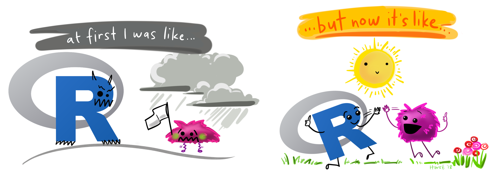

layout: true

```{r meta, echo=FALSE}
# libraries
pacman::p_load(knitr, tidyverse, psych, EFAtools, janitor, metathis)

xaringanExtra::use_share_again()
xaringanExtra::style_share_again(share_buttons = c("twitter", "facebook", "linkedin"))

meta() %>% 
  meta_name("github-repo" = "chris-allones/SEM-R-training") %>% 
  meta_social(
    title = "SEM using R",
    description = "Training on structural equation modeling using R.",
    url = "https://chris-allones.github.io/SEM-R-training/index.html",
    image = "https://chris-allones.github.io/SEM-R-training/images/preview.png",
    og_type = "website",
    og_author = "Christopher Llones",
    twitter_card_type = "summary_large_image",
    twitter_creator = "@Topenomics",
    twitter_site = "@Topenomics"
  )

```

```{r setup, echo=FALSE}
# working directory
setwd(dir = "D:/OneDrive - KMITL/Documents/Git files/trainings/SEM_presentation/00_intro_r/")

options(htmltools.dir.version = FALSE,
        knitr.table.format = "html")

knitr::opts_chunk$set(
  fig.width=9, fig.height=3.5, fig.retina=3,
  out.width = "100%",
  cache = FALSE,
  echo = TRUE,
  message = FALSE, 
  warning = FALSE,
  hiline = TRUE,
  comment = "",
  fig.retina = 3
)

```

```{r xaringan-themer, echo=FALSE, warning=FALSE}
library(xaringanthemer)

xaringanExtra::use_share_again()
xaringanExtra::style_share_again(share_buttons = c("twitter", "facebook", "linkedin"))
xaringanExtra::use_tile_view()
xaringanExtra::use_extra_styles(hover_code_line = TRUE,
                                mute_unhighlighted_code = FALSE)

xaringanExtra::use_animate_css()
xaringanExtra::use_animate_all("fade")

style_duo_accent(
  primary_color = "#073b4c",
  secondary_color = "#2a9d8f",
  inverse_background_color = "#073b4c",
  inverse_header_color = "#fff",
  # title_slide_background_color = "#073b4c",
  title_slide_background_image = "img/background.jpg",
  title_slide_text_color = "#212529",
  text_font_size = "1.1rem"
)


```


---

## Overview

+ R objects

+ Data frames

+ R packages
  
+ tidyverse

  +  %>% pipe operator 
  + `select()`
  + `filter()`
  + `mutate()`
  + `rename()`
  + `arrange()`
  + `group_by()` and `summarize()`
  
---

### It's normal to struggle but it gets better and exciting!


```{r echo=FALSE, out.width="80%", fig.align='center'}

```

.fifty[Illustration adapted from [Allison Horst](https://twitter.com/allison_horst)]

---


