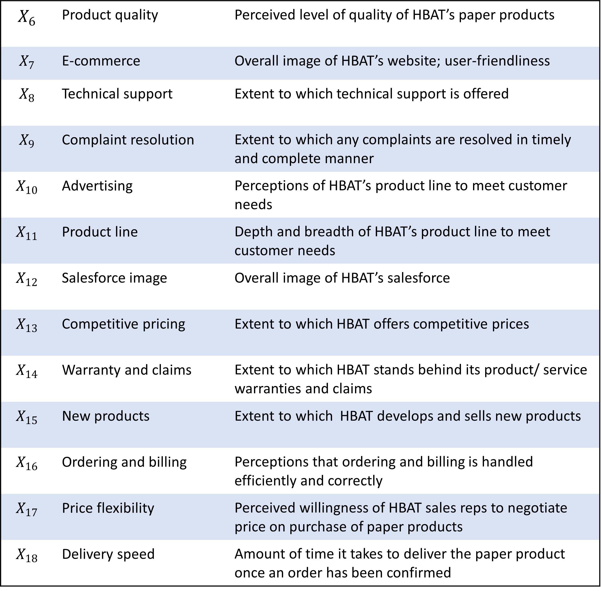
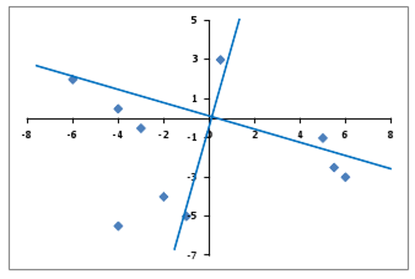
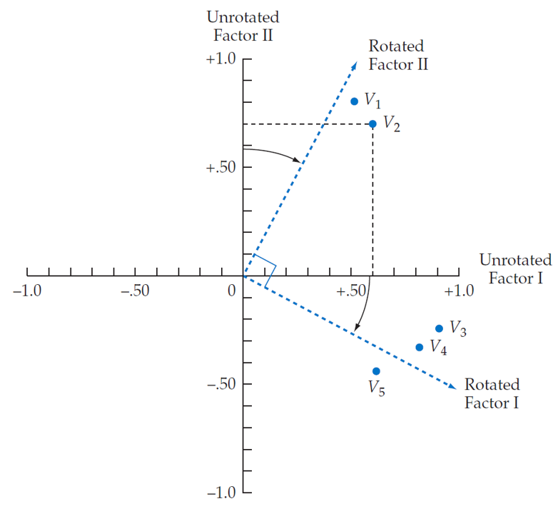
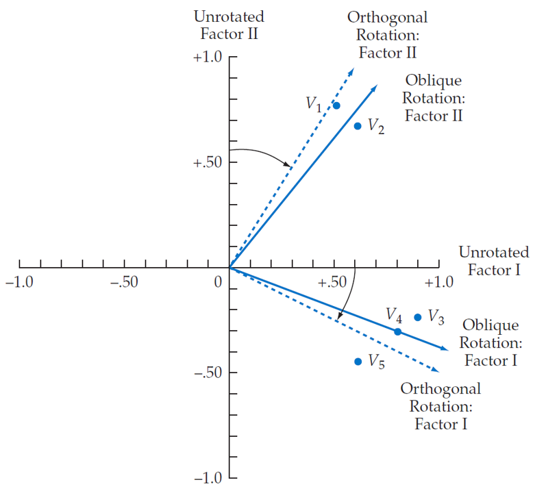

layout: true

```{r meta, echo=FALSE}
# libraries
pacman::p_load(knitr, tidyverse, psych, EFAtools, janitor, metathis)

xaringanExtra::use_share_again()
xaringanExtra::style_share_again(share_buttons = c("twitter", "facebook", "linkedin"))

meta() %>% 
  meta_name("github-repo" = "chris-allones/SEM-R-training") %>% 
  meta_social(
    title = "SEM using R",
    description = "Training on structural equation modeling using R.",
    url = "https://chris-allones.github.io/SEM-R-training/index.html",
    image = "https://chris-allones.github.io/SEM-R-training/images/preview.png",
    og_type = "website",
    og_author = "Christopher Llones",
    twitter_card_type = "summary_large_image",
    twitter_creator = "@Topenomics",
    twitter_site = "@Topenomics"
  )

```


```{r setup, echo=FALSE}
# working directory
# setwd(dir = "D:/OneDrive - KMITL/Documents/Git files/trainings/SEM_presentation/01_efa")

options(htmltools.dir.version = FALSE,
        knitr.table.format = "html")

knitr::opts_chunk$set(
  fig.width=9, fig.height=3.5, fig.retina=3,
  out.width = "100%",
  cache = FALSE,
  echo = TRUE,
  message = FALSE, 
  warning = FALSE,
  hiline = TRUE,
  comment = "",
  fig.retina = 3
)

```

```{r xaringan-themer, echo=FALSE, warning=FALSE}
library(xaringanthemer)

xaringanExtra::use_tile_view()
xaringanExtra::use_extra_styles(hover_code_line = TRUE,
                                mute_unhighlighted_code = FALSE)

xaringanExtra::use_animate_css()
xaringanExtra::use_animate_all("fade")

style_duo_accent(
  primary_color = "#073b4c",
  secondary_color = "#2a9d8f",
  inverse_background_color = "#073b4c",
  inverse_header_color = "#fff",
  # title_slide_background_color = "#073b4c",
  title_slide_background_image = "image/background.jpg",
  title_slide_text_color = "#212529",
  text_font_size = "1.1rem"
)


```

```{r data-library, echo=FALSE}
# data management
data <- haven::read_sav("data/HBAT.sav") %>%
  select(x6:x18) %>% 
  select(-x15, -x17) %>% # removing variables with below acceptable MSA
  tibble() %>% 
  clean_names(.)

```


---
## Factor analysis process

**Stage 1**: Objectives of factor analysis

**Stage 2**: Designing an Exploratory factor analysis

**Stage 3**: Assumptions in Exploratory factor analysis

**Stage 4**: Deriving factors and assessing overall fit

**Stage 5**: Interpreting the factors

---

class: middle center

# Stage 1 : Objectives of factor analysis
----

---

## Types of factor analysis

.leftcol[
#### Exploratory factor analysis

+ Use when you do not have a well-developed theory

+ Estimate all possible variable/ factor relationships

+ Looking for patterns in the data
]


.rightcol[
#### Confirmatory factor analysis

+ Testing a theory that you know in advance 

+ Only specified variables/factor relationships
]

---

## Types of factor analysis

.left-column-50[
#### Exploratory factor analysis

- Difficult to interpret without a theory.
- factor loadings: meanings can sometimes be inferred  from patterns.
]

<br>

.right-column-50[
```{r echo=FALSE, out.width="50%", fig.align='center'}
knitr::include_graphics("image/efa_interpret.png")
```
]

---

## Types of factor analysis

.left-column-50[
#### Confirmatory factor analysis

- Model fit: how well the hypothesized model fits the data.

- Factor loadings: how well items measure their corresponding constructs.
]

<br>

.right-column-50[
```{r echo=FALSE, out.width="50%", fig.align='center'}
knitr::include_graphics("image/cfa_interpret.png")
```
]

---

class: middle center

# Stage 2: Designing an EFA
----

---

## Variable selection and measurement issues

--
What types of variables can be used in factor analysis?

--
  + *Primary requirement: a correlation value can be calculated among all variables.*
  + *e.g., metric variables, scale items, dummy variables to represent nonmetric variables.*

<br>

How many variables should be included?

  + *Five or more per factor for scale development.*
  + *Three or more per factor for factor measurement (based on how degrees of freedom is computed).*
  
---

## Sample size

Some recommended guidelines:

Absolute size of the dataset
  + *should not fewer than 50 observation*
  + *preferably 100 and larger*
  + *200 and larger as the number of variables and expected factors incerases*

Ratio of cases to variables
  + *observation is 5x as the number of variables*
  + *sample size is 10:1 ratio*
  + *some proposes 20 cases per variables*
  
---

class: middle center

# Stage 3: Assumptions in EFA
----

---

## Sample Dataset

.leftcol40[
+ HBAT Industries, manufacturer of paper products.
+ Perceptions on a set of business functions.
+ Rating scale: 
  + `0 "poor"` to `10 "excellent"`
]

.rightcol60[
```{r echo=FALSE, out.width="80%", fig.align='center'}

```
]

---

## Sample Dataset

.leftcol40[
+ $X_6$ product quality
+ $X_7$ e-commerce
+ $X_8$ technical support
+ $X_9$ complaint resolution
+ $X_{10}$ advertising
+ $X_{11}$ product line
+ $X_{12}$ salesforce image
+ $X_{13}$ competitive pricing
+ $X_{14}$ warranty claims
+ $X_{15}$ packaging
+ $X_{16}$ order & billing
+ $X_{17}$ price flexibility
+ $X_{18}$ delivery speed
]

.rightcol60[
.code80[
```{r echo=FALSE}
rmarkdown::paged_table(data)
```
]

.font80[Source: J.F. Hair (2019): Multivariate data analysis.]

]

---

## Conceptual assumptions

.leftcol70[
+ Some uderlying structure does exist in the set of selected variables.
+ correlated variables and subsequent definition of factors do not guarantee relevance
  + *even if they meet the statistical requirement!*
+ It is the responsibility of the researcher to ensure that observed patterns are conceptually valid and appropriate.
]

---

## Determining appropriateness of EFA

1. Bartlett Test

2. Measure of Sampling Adequacy

---

## Determining the appropriateness of EFA

.leftcol[
#### 1. Bartlett Test
+ Examines the entire correlation matrix
+ Test the hypothesis that correlation matrix is an identity matrix.
+ A significant result signifies data are appropriate for factor analysis.
]

.rightcol[
.details[
```{r}
library(EFAtools)
BARTLETT(data, N= nrow(data))
```
]
]

---

## Determining the appropriateness of EFA

#### 2. Kaiser-Meyen-Olkin (KMO Test)
+ Measure of sampling adequacy
+ Indicate the proportion of variance explained by the underlying factor.
+ Guidelines:
  -   $\ge 0.90$ - marvelous
  -   $\ge 0.80$ - meritorious
  -   $\ge 0.70$ - middling
  -   $\ge 0.60$ - mediocre
  -   $\ge 0.50$ - miserable
  -   $< 0.50$ - unacceptable


---

## Determining the appropriateness of EFA

#### 2. Kaiser-Meyen-Olkin (KMO Test)

.code70[
.details[
```{r echo=FALSE}
library(psych)
KMO(data)
```
]
]
---

## Determining the appropriateness of EFA

#### 2. Kaiser-Meyen-Olkin (KMO Test)

+ When overall MSA is less than 0.50
  + Identify variables with lowest MSA subject for deletion.
  + Recalculate MSA
  + Repeat unitl overall MSA is 0.50 and above


+ Deletion of variables with MSA under 0.50 means variable's correlation with <br>other variables are poorly representing the extracted factor.


---

class: middle center

# Let's practice!

---

class: middle center

# Stage 4: Deriving factors and <br>assessing overall fit
----

---

## Partitioning the variance of a variable

.leftcol[
#### Unique variance
+ Variance associated with only a specific variable.
+ Not represented in the correlations among variables.
+ *Specific variance*
  + associated uniquely with a single variable.
+ *Error variance*
  + May be due to unreliability of data gathering process, measurement error, or a random component in the measured phenomenom.
]

.rightcol[
#### Common variance
+ Shared variance with all other variables.
+ High common variance are more amenable for factor analysis.
+ Derived factors represents the shared or common variance among the variables.
]

---

## Partitioning the variance of a variable

.center[
```{r echo=FALSE, out.width="55%"}
knitr::include_graphics("image/deriving_factors.png")
```

.font70[_Source: JF Hair et al. (2019) Multivariate data analysis._<br>] 
]

---

## PCA vs Common factor analysis

.leftcol[
#### Principal component analysis (PCA)
+ Considers the total variance
+ data reduction is a primary concern

#### Common factor analysis
+ Considers only the common variance or shared variance
+ Primary objective is to identify the latent dimensions or constructs
]

.rightcol[
<br>
<br>
<br>
.center[
```{r echo=FALSE, out.width="85%"}
knitr::include_graphics("image/pca_cfa.png")
```

.font70[_Source: JF Hair et al. (2019) Multivariate data analysis._]]
]


---

## Exploring possible factors

.leftcol40[
#### 1. Kaiser-Guttman Criterion
+ Only consider factors whose eigenvalues is greater than 1.

+ Rationale is that factor should account for the variance of at least a single variable if it is to be retained for interpretation.
]

.rightcol60[
```{r eval=FALSE}
library(EFAtools)
KGC(Data, eigen_type = "EFA")
```

```{r echo=FALSE, out.width="75%", fig.align='center'}
knitr::include_graphics("image/kgc_plot.png")
```
]


---

## Exploring possible factors

.leftcol40[
#### 2. Scree test
+ Identify the optimum number of factors that can be extracted before the amount of unique variance begins to dominate the common variance.

+ Inflection point or the "elbow"
]

.rightcol60[
```{r eval=FALSE}
library(psych)
scree(data)
```

```{r echo = FALSE, out.width="75%", fig.align='center'}
knitr::include_graphics("image/scree_plot.png")
```
]


---

## Exploring possible factors

.leftcol[
#### 3. Parallel Test
+ Generates a large number of simulated dataset.
+ Each simulated dataset is factor analyzed.
  + Results is the average eigenvalues across simulation.
  + Values are then compared to the eigenvalues extracted from the original dataset.
  + All factors with eigenvalues above those average eigenvalues are retained.
]

.rightcol[
```{r eval=FALSE}
library(psych)
fa.parallel(data, fa = "fa")
```

```{r echo = FALSE, out.width="90%", fig.align='center'}
knitr::include_graphics("image/parallel_plot.png")
```
]


---

class: middle center

# Let's practice!

---

class: middle center

# Stage 5: Interpreting the factors
----

---

## Three process of factor intepretation

#### 1. Factor extraction
#### 2. Factor rotation
#### 3. Factor interpretation and re-specification

---

## Factor extraction

.rightcol[
.code40[
```{r}
fa_unrotated <- fa(r = data, nfactors = 4,rotate = "none")
print(fa_unrotated$loadings)
```
]
]

.leftcol[
#### Loadings
+ Correlation of each variable and the factor.
+ Indicate the degree of correspondence between variable and factor.
+ Higher loadings making the variable representative of the factor.
]

---

## Factor extraction

.rightcol[
.code30[
```{r}
fa_unrotated <- fa(r = data, nfactors = 4,rotate = "none")
print(fa_unrotated$loadings)
```
]
]

.leftcol[
#### Loadings
+ $\le \pm 0.10 \approx$ zero
+ $\pm 0.10$ to $\pm 0.40$ meet the minimal level
+ $\ge \pm 0.50$ practically significant
+ $\ge \pm 0.70 \approx$ well-defined structure

#### SS loadings
+ Eigenvalues - column sum of squared factor loadings.
+ Relative importance of each factor in accounting for the variance associated with the set of variables.
]

---

## Factor rotation

.leftcol[
#### Why do factor rotation?
+ To simplify the complexity of factor loadings.
+ Distribute the loadings more clearly into the factors.
+ Facilitate interpretation.
]

.rightcol[
```{r echo=FALSE, out.width="80%"}

```
]


---

## Factor rotation

.leftcol35[
.code30[
```{}
par(mfrow = c(1, 2))
plot(fa_unrotated$loadings[,1], fa_unrotated$loadings[,2],
     xlab = "Factor 1", ylab = "Factor 2",
     ylim = c(-1, 1), xlim = c(-1, 1),
     main = "No rotation",
     pch = 19, col = "#6c757d") 
     abline(h=0, v=0)
     text(fa_unrotated$loadings[,1], fa_unrotated$loadings[,2],
          labels = rownames(fa_unrotated$loadings),
          pos = 4, cex = 0.5)

plot(fa_rotated$loadings[,1], fa_rotated$loadings[,2],
     xlab = "Factor 1", ylab = "Factor 2",
     ylim = c(-1, 1), xlim = c(-1, 1),
     main = "With rotation",
     pch = 19, col = "#6c757d")
     abline(h=0, v=0)
     text(fa_rotated$loadings[,1], fa_rotated$loadings[,2],
          labels = rownames(fa_unrotated$loadings),
          pos = 4, cex = 0.5)
```
]
]


.rightcol65[
```{r echo=FALSE}
fa_rotated <- fa(r = data, nfactors = 4,rotate = "varimax")

par(mfrow = c(1, 2))
plot(fa_unrotated$loadings[,1],
     fa_unrotated$loadings[,2],
     xlab = "Factor 1",
     ylab = "Factor 2",
     ylim = c(-1, 1),
     xlim = c(-1, 1),
     main = "No rotation",
     pch = 19,
     col = "#6c757d") 
     abline(h=0, v=0)
     text(fa_unrotated$loadings[,1],
          fa_unrotated$loadings[,2],
          labels = rownames(fa_unrotated$loadings),
          pos = 4, cex = 0.5)

plot(fa_rotated$loadings[,1],
     fa_rotated$loadings[,2],
     xlab = "Factor 1",
     ylab = "Factor 2",
     ylim = c(-1, 1),
     xlim = c(-1, 1),
     main = "With rotation",
     pch = 19,
     col = "#6c757d")
     abline(h=0, v=0)
     text(fa_rotated$loadings[,1],
          fa_rotated$loadings[,2],
          labels = rownames(fa_unrotated$loadings),
          pos = 4, cex = 0.5)

```
]

---

## Factor rotation

.leftcol[
#### Orthogonal rotation

+ axes are maintained at 90 degrees
+ orthogonal rotation methods
  + Varimax - *most commonly used*
  + Quartimax
  + Equimax
+ Check-out some of these references
  + [IBM](https://www.ibm.com/docs/de/spss-statistics/24.0.0?topic=analysis-factor-rotation)
  + [Factor analysis](http://statweb.stanford.edu/~susan/courses/stats305c/examplesFA.html)
]

.rightcol[
```{r echo=FALSE, out.width="90%"}

```

]
---

## Factor rotation

#### Orthogonal rotation

```{r echo=FALSE}
fa_varimax <- fa(r = data, nfactors = 4,rotate = "varimax")
fa_quartimax <- fa(r = data, nfactors = 4,rotate = "quartimax")
fa_equamax <- fa(r = data, nfactors = 4,rotate = "equamax")

par(mfrow = c(1, 4))

plot(fa_unrotated$loadings[,1],
     fa_unrotated$loadings[,2],
     xlab = "Factor 1",
     ylab = "Factor 2",
     ylim = c(-1, 1),
     xlim = c(-1, 1),
     main = "No rotation",
     pch = 19,
     col = "#6c757d") 
     abline(h=0, v=0)
     text(fa_unrotated$loadings[,1],
          fa_unrotated$loadings[,2],
          labels = rownames(fa_unrotated$loadings),
          pos = 4, cex = 0.5)
     
plot(fa_varimax$loadings[,1],
     fa_varimax$loadings[,2],
     xlab = "Factor 1",
     ylab = "Factor 2",
     ylim = c(-1, 1),
     xlim = c(-1, 1),
     main = "Varimax",
     pch = 19,
     col = "#6c757d") 
     abline(h=0, v=0)
     text(fa_varimax$loadings[,1],
          fa_varimax$loadings[,2],
          labels = rownames(fa_varimax$loadings),
          pos = 4, cex = 0.5)

plot(fa_quartimax$loadings[,1],
     fa_quartimax$loadings[,2],
     xlab = "Factor 1",
     ylab = "Factor 2",
     ylim = c(-1, 1),
     xlim = c(-1, 1),
     main = "Quartimax",
     pch = 19,
     col = "#6c757d") 
     abline(h=0, v=0)
     text(fa_quartimax$loadings[,1],
          fa_quartimax$loadings[,2],
          labels = rownames(fa_quartimax$loadings),
          pos = 4, cex = 0.5)
     
plot(fa_equamax$loadings[,1],
     fa_equamax$loadings[,2],
     xlab = "Factor 1",
     ylab = "Factor 2",
     ylim = c(-1, 1),
     xlim = c(-1, 1),
     main = "Equamax",
     pch = 19,
     col = "#6c757d") 
     abline(h=0, v=0)
     text(fa_equamax$loadings[,1],
          fa_equamax$loadings[,2],
          labels = rownames(fa_equamax$loadings),
          pos = 4, cex = 0.5)


```


---

## Factor rotation

.leftcol[
#### Oblique rotation rotation
+ allow correlated factors
+ suited to the goal of theoretically meaningful constructs
+ oblique rotation methods
  + Promax
  + Oblimin
]

.rightcol[
```{r echo=FALSE, out.width="85%"}

```
]

---

## Factor rotation

#### Oblique rotation

```{r echo=FALSE}
fa_promax <- fa(r = data, nfactors = 4,rotate = "promax")
fa_oblimin <- fa(r = data, nfactors = 4,rotate = "oblimin")


par(mfrow = c(1, 3))

plot(fa_unrotated$loadings[,1],
     fa_unrotated$loadings[,2],
     xlab = "Factor 1",
     ylab = "Factor 2",
     ylim = c(-1, 1),
     xlim = c(-1, 1),
     main = "No rotation",
     pch = 19,
     col = "#6c757d") 
     abline(h=0, v=0)
     text(fa_unrotated$loadings[,1],
          fa_unrotated$loadings[,2],
          labels = rownames(fa_unrotated$loadings),
          pos = 4, cex = 0.5)
     
plot(fa_promax$loadings[,1],
     fa_promax$loadings[,2],
     xlab = "Factor 1",
     ylab = "Factor 2",
     ylim = c(-1, 1),
     xlim = c(-1, 1),
     main = "Promax",
     pch = 19,
     col = "#6c757d") 
     abline(h=0, v=0)
     text(fa_promax$loadings[,1],
          fa_promax$loadings[,2],
          labels = rownames(fa_promax$loadings),
          pos = 4, cex = 0.5)

plot(fa_oblimin$loadings[,1],
     fa_oblimin$loadings[,2],
     xlab = "Factor 1",
     ylab = "Factor 2",
     ylim = c(-1, 1),
     xlim = c(-1, 1),
     main = "Oblimin",
     pch = 19,
     col = "#6c757d") 
     abline(h=0, v=0)
     text(fa_oblimin$loadings[,1],
          fa_oblimin$loadings[,2],
          labels = rownames(fa_oblimin$loadings),
          pos = 4, cex = 0.5)
     
```

---
class: middle center

# Let's practice!

---

## Factor interpretation and respecification

.leftcol40[
+ each variable has a high loadings on one factor only

+  each factor has a high loadings  for only a subset of the items.
]

.rightcol60[
.code40[
```{r}
fa_varimax <- fa(r = data, nfactors = 4, rotate = "varimax")
print(fa_varimax$loadings, sort = TRUE)
```
]
]

---

## Factor interpretation and respecification

.leftcol40[
+ each variable has a high loadings on one factor only

+  each factor has a high loadings  for only a subset of the items.
]

.rightcol60[
.code40[
```{r}
fa_varimax <- fa(r = data, nfactors = 4, rotate = "varimax")
print(fa_varimax$loadings, sort = TRUE, cutoff = 0.4)
```
]
]

---

## Factor interpretation and respecification

.leftcol40[

What to do with cross-loadings?

Ratio of variance (*JF Hair et al. 2019*)

+ 1 to 1.5 - problematic
+ 1.5 to 2.0 - potential cross-loading
+ 2.0 and higher - ignorable

Example:

+ $X_{11}$
+ `MR1`: 0.525
+ `MR2`: 0.712
+ $0.712^2 \div 0.525^2 = 1.8$
]

.rightcol60[
.code40[
```{r}
fa_varimax <- fa(r = data, nfactors = 4, rotate = "varimax")
print(fa_varimax$loadings, sort = TRUE, cutoff = 0.4)
```
]
]

---

class: middle center

# Let's practice!

---

class: middle center

# Thank you!

#### Slides created via the R packages:

.leftcol[
 

### xaringan by Yihui
]

.rightcol[
 

### xaringanthemer and xaringanExtra by Garrick
]


