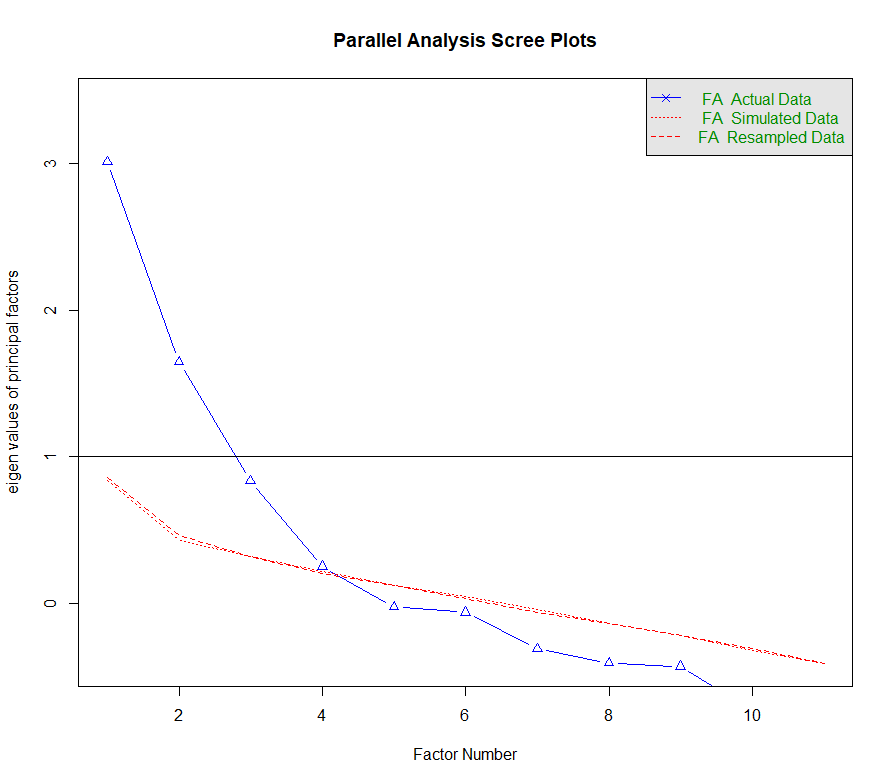

layout: true

```{r setup, echo=FALSE}
# working directory
setwd(dir = "D:/OneDrive - KMITL/Documents/Git files/trainings/SEM_presentation/01_efa")

options(htmltools.dir.version = FALSE,
        knitr.table.format = "html")

knitr::opts_chunk$set(
  fig.width=9, fig.height=3.5, fig.retina=3,
  out.width = "100%",
  cache = FALSE,
  echo = TRUE,
  message = FALSE, 
  warning = FALSE,
  hiline = TRUE,
  comment = "",
  fig.retina = 3
)

```

```{r xaringan-themer, echo=FALSE, warning=FALSE}
library(xaringanthemer)
style_duo_accent(
  primary_color = "#073b4c",
  secondary_color = "#2a9d8f",
  inverse_background_color = "#FFFFFF",
  inverse_header_color = "#073b4c",
  title_slide_background_color = "#073b4c",
  title_slide_text_color = "#FFF",
  text_font_size = "1.2rem"
)

xaringanExtra::use_tile_view()
xaringanExtra::use_extra_styles(hover_code_line = TRUE,
                                mute_unhighlighted_code = FALSE)
```

```{r data-library, echo=FALSE}
# libraries
pacman::p_load(knitr, tidyverse, psych, EFAtools, janitor)

# data management
data <- haven::read_sav("data/HBAT.sav") %>%
  select(x6:x18) %>% 
  select(-x15, -x17) %>% # removing variables with below acceptable MSA
  tibble() %>% 
  clean_names(.)

```


---
## Learning objectives

1. Perform
2. Perform

---
class: middle center

# Factor analysis
----

---

## Types of factor analysis

.left-column-50[
#### Exploratory factor analysis

- Estimate all possible variable/ factor relationships
- Looking for patterns in the data
- Use when you don't have a well-dveloped theory
]

--

<br>
.right-column-50[
#### Confirmatory factor analysis

- Only specified variables/factor relationships
- Testing a theory that you know in advance
- This is the right thing to publish!
]

---

## Interpreting factor analysis

.left-column-50[
#### Exploratory factor analysis

- Difficult to interpret without a theory.
- factor loadings: meanings can sometimes be inferred  from patterns.
]

<br>

.right-column-50[
```{r echo=FALSE, out.width="50%"}

```
]

---

## Interpreting factor analysis

.left-column-50[
#### Confirmatory factor analysis

- Model fit: how well the hypothesized model fits the data.
- Factor loadings: how well items measure their corresponding constructs.
]

<br>

.right-column-50[
```{r echo=FALSE, out.width="50%"}

```
]

---
class: middle center

# Exploratory Factor Analysis
----

---

## How many dimensions do you have?

<br>
```{r echo=FALSE, out.width="50%", fig.align="center"}

```

---

## Dataset

.leftcol40[
(Info here!)
]

.rightcol60[
.code80[
```{r }
rmarkdown::paged_table(data)
```
]

]

---

## Overall measures of intercorrelation

1. Bartlett Test
2. Measure of Sampling Adequacy

---

## Overall measures of intercorrelation

.leftcol[
#### 1. Bartlett Test
+ Examines the entire correlation matrix
+ Test the hypothesis that correlation matrix is an identity matrix.
+ A significant reulst signifies data are appropriate for FA
]

--
.rightcol[
```{r}
BARTLETT(data, N= nrow(data))
```
]

---

## Overall measures of intercorrelation

#### 2. Kaiser-Meyen-Olkin (KMO Test)
+ Measure of sampling adequacy
+ Indicate the proportion of variance explained by the underlying factor.
+ Guidelines:
  -   $\ge 0.90$ - marvelous
  -   $\ge 0.80$ - meritorious
  -   $\ge 0.70$ - middling
  -   $\ge 0.60$ - mediocre
  -   $\ge 0.50$ - miserable
  -   $< 0.50$ - unacceptable


---
## Overall measures of intercorrelation

#### 2. Kaiser-Meyen-Olkin (KMO Test)
--
```{r eval=FALSE}
library(psych)
KMO(data)
```

.code70[
```{r echo=FALSE}
KMO(data)
```
]
---
## Overall measures of intercorrelation

#### 2. Kaiser-Meyen-Olkin (KMO Test)

--
+ When overall MSA is less than 0.50
  + Identify variables with lowest MSA subject for deletion.
  + Recalculate MSA
  + Repeat unitl overall MSA is 0.50 and above


+ Deletion of variables with MSA under 0.50 means variable's correlation with <br>other variables are poorly representing the extracted factor.

---
## Overall measures of intercorrelation

#### 2. Kaiser-Meyen-Olkin (KMO Test)
--

.leftcol40[
```{r eval=FALSE}
# Deselecting X15
data_deselect <- data %>% 
  select(-x15, -x17)

KMO(data_deselect)
```
]

.rightcol60[
```{r echo=FALSE}
# Deselecting X15 & x17
# data_deselect <- data %>% 
#   select(-x15, -x17)

# KMO(data_deselect)
```
]


---
class: middle center

# Let's practice!

---
class: middle center

# Selecting factor extraction method
----

---
## Partitioning the variance of a variable

.leftcol[
#### Unique variance
+ Variance associated with only a specific variable.
+ Not represented in the correlations among variables.
+ *Specific variance*
  + associated uniquely with a single variable.
+ *Error variance*
  + May be due to unreliability of data gathering process, measurement error, or a random component in the measured phenomenom.
]

.rightcol[
#### Common variance
+ Shared variance with all other variables.
+ High common variance are more amenable for factor analysis.
+ Derived factors represents the shared or common variance among the variables.
]

---

## Partitioning the variance of a variable

.center[
```{r echo=FALSE, out.width="55%"}
knitr::include_graphics("image/deriving_factors.png")
```

.font70[_Source: JF Hair et al. (2019) Multivariate data analysis._<br>] 
]

---

## PCA vs Common factor analysis

.leftcol[
#### Principal component analysis (PCA)
+ Considers the total variance
+ data reduction is a primary concern

#### Common factor analysis
+ Considers only the common variance or shared variance
+ Primary objective si to identify the laten dimensions or constructs
]

.rightcol[
<br>
<br>
<br>
.center[
```{r echo=FALSE, out.width="85%"}
knitr::include_graphics("image/pca_cfa.png")
```

.font70[_Source: JF Hair et al. (2019) Multivariate data analysis._]]
]


---

### Exploring possible factor

.leftcol40[
#### 1. Kaiser-Guttman Criterion
+ Only consider factors whose eigenvalues is greater than 1.

+ Rationale is that factor should account for the variance of at least a single variable if it is to be retained for interpretation.
]

--
.rightcol60[
```{r echo=FALSE, results='hide'}
png(filename = "image/kgc_plot.png")
KGC(data, eigen_type = "EFA")
dev.off()
```

```{r eval=FALSE}
library(EFAtools)
KGC(Data, eigen_type = "EFA")
```

```{r echo=FALSE, out.width="70%", fig.align='center'}
knitr::include_graphics("image/kgc_plot.png")
```

]


---

## Exploring possible factors

.leftcol40[
#### 2. Scree test
+ Identify the optimum number of factors that can be extracted before the amount of unique variance begins to dominate the common variance.

+ Inflection point or the "elbow"
]

--
.rightcol60[
```{r echo=FALSE, results='hide'}
library(EFAtools)
png(filename = "image/scree_plot.png")
scree(data)
dev.off()
```

```{r eval=FALSE}
library(psych)
scree(data)
```

```{r echo = FALSE, out.width="70%", fig.align='center'}
knitr::include_graphics("image/scree_plot.png")
```
]


---

## Exploring possible factors

.leftcol[
#### 3. Parallel Test
+ Generates a large number of simulated dataset.
+ Each simulated dataset is factor analyzed.
  + Results is the average eigenvalues across simulation.
  + Values are then compared to the eigenvalues extracted from the original dataset.
  + All factors with eigenvalues above those average eigenvalues are retained.

]

--
.rightcol[
```{r echo=FALSE, results='hide'}
library(EFAtools)
png(filename = "image/parallel_plot.png")
fa.parallel(data, fa = "fa")
dev.off()
```

```{r eval=FALSE}
library(psych)
fa.parallel(data, fa = "fa")
```

```{r echo = FALSE, out.width="85%", fig.align='center'}

```
]


---
class: middle center

# Let's practice!

---

## Three process of factor intepretation

#### 1. Factor extraction
#### 2. Factor rotation
#### 3. Factor interpretation and re-specification

---
## Factor extraction

.rightcol[
.code40[
```{r}
fa_unrotated <- fa(r = data, nfactors = 4,rotate = "none")
print(fa_unrotated$loadings)
```
]
]

--

.leftcol[
#### Loadings
+ Correlation of each variable and the factor.
+ Indicate the degree of correspondence between variable and factor.
+ Higher loadings making the variable representative of the factor.
]

---
## Factor extraction

.rightcol[
.code30[
```{r}
fa_unrotated <- fa(r = data, nfactors = 4,rotate = "none")
print(fa_unrotated$loadings)
```
]
]

--

.leftcol[
#### Loadings
+ $\le \pm 0.10 \approx$ zero
+ $\pm 0.10$ to $\pm 0.40$ meet the minimal level
+ $\ge \pm 0.50$ practically significant
+ $\ge \pm 0.70 \approx$ well-defined structure

#### SS loadings
+ Eigenvalues - column sum of squared factor loadings.
+ Relative importance of each factor in accounting for the variance associated with the set of variables.
]

---
## Factor rotation
#### Why do factor rotation?


