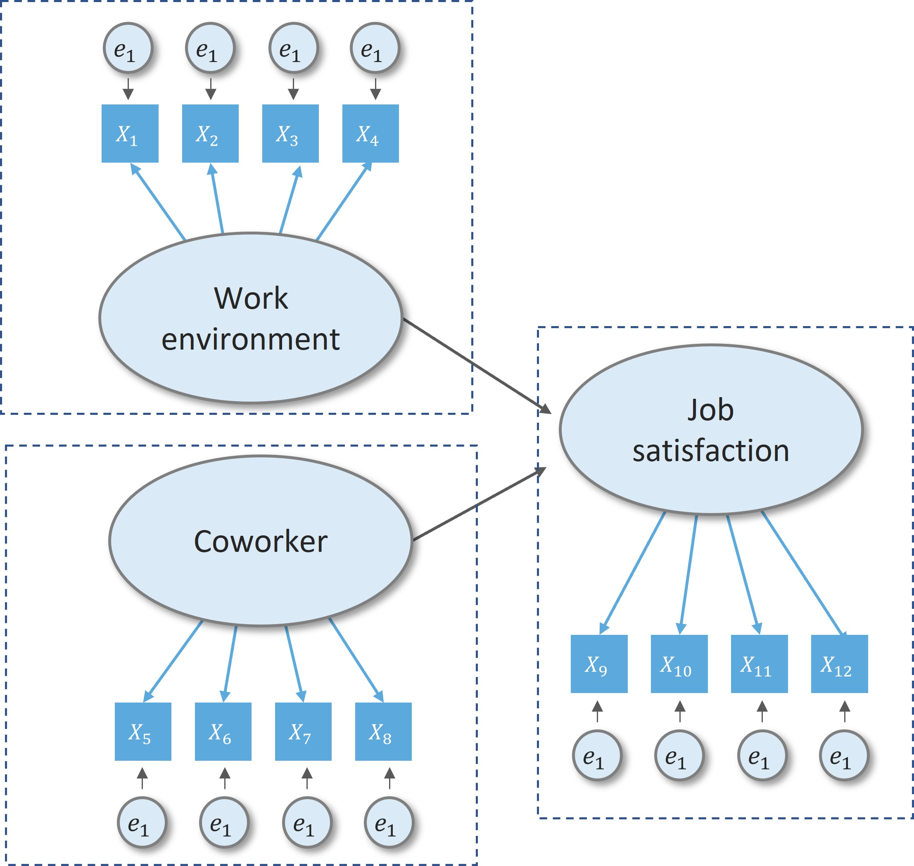
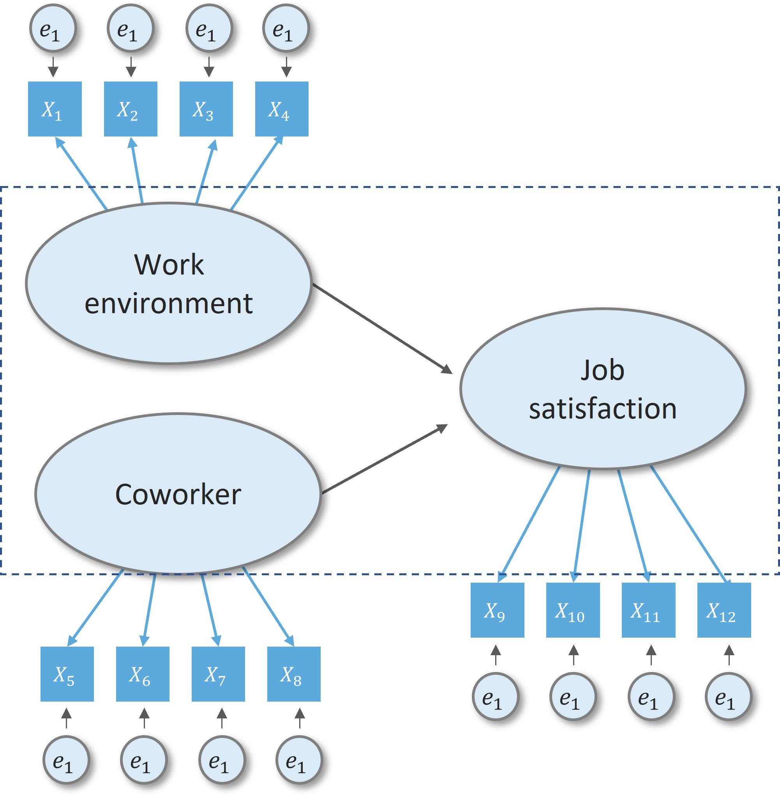
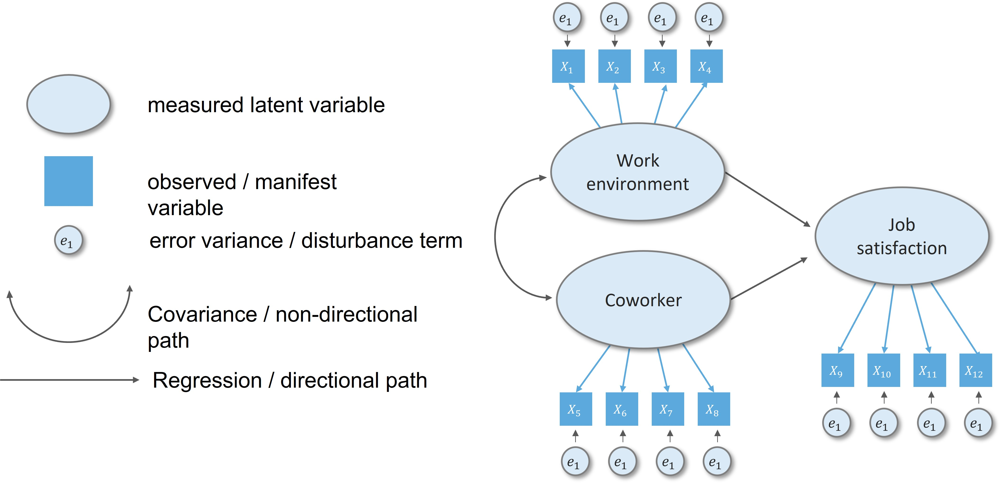

layout: true

```{r setup, echo=FALSE}
# working directory
setwd(dir = "D:/OneDrive - KMITL/Documents/Git files/trainings/SEM_presentation/02_cfa_sem/")

options(htmltools.dir.version = FALSE,
        knitr.table.format = "html")

knitr::opts_chunk$set(
  fig.width=9, fig.height=3.5, fig.retina=3,
  out.width = "100%",
  cache = FALSE,
  echo = TRUE,
  message = FALSE, 
  warning = FALSE,
  hiline = TRUE,
  comment = "",
  fig.retina = 3
)

```

```{r xaringan-themer, echo=FALSE, warning=FALSE}
library(xaringanthemer)

xaringanExtra::use_share_again()
xaringanExtra::style_share_again(share_buttons = c("twitter", "facebook", "linkedin"))
xaringanExtra::use_tile_view()
xaringanExtra::use_extra_styles(hover_code_line = TRUE,
                                mute_unhighlighted_code = FALSE)

xaringanExtra::use_animate_css()
xaringanExtra::use_animate_all("fade")

style_duo_accent(
  primary_color = "#073b4c",
  secondary_color = "#2a9d8f",
  inverse_background_color = "#073b4c",
  inverse_header_color = "#fff",
  # title_slide_background_color = "#073b4c",
  title_slide_background_image = "img/background.jpg",
  title_slide_text_color = "#212529",
  text_font_size = "1.1rem"
)


```

```{r data-library, echo=FALSE}
# libraries
pacman::p_load(knitr, tidyverse, psych, EFAtools, janitor)

# data management
data <- haven::read_sav("data/HBAT.sav") %>%
  select(x6:x18) %>% 
  select(-x15, -x17) %>% # removing variables with below acceptable MSA
  tibble() %>% 
  clean_names(.)

```

---

## Topic overview

**1**: CFA-SEM overview

**2**: CFA-SEM with Lavaan

**3**: Designing a study to produce empirical results

**4**: Assessing measurement model validity

**5**: Specifying the structural model

**6**: Assessing the structural model validity

---

class: middle center

# CFA-SEM overview
----

---

## What is SEM?

+ Not a one statistical "technique"
+ Integrates a number of different multivariate technique
+ Distinction between:
  + measurement model
  + structural model

---

## What is SEM?

.leftcol40[

#### Measurement model

+ measurement part of a a full SEM model
+ confirmatory factor analysis
]

.rightcol60[
```{r echo=FALSE, out.width="70%", fig.align='center'}

```
]

---

## What is SEM?

.leftcol40[

#### Measurement model

+ measurement part of a a full SEM model
+ confirmatory factor analysis

#### Structural model

+ relationship between constucts
+ full sem model is combination of measurement and structural component

]

.rightcol60[
```{r echo=FALSE, out.width="70%", fig.align='center'}

```
]

---

## Basic SEM conventions

.center[
```{r echo=FALSE, out.width="80%"}

```
]

---

class: middle center

# 2. CFA-SEM with Lavaan R package
----

---

## What is Lavaan?

.leftcol30[
+ *"developed to provide useRs, researchers, and teachers a free open-source, but commercial quality"*, Yves Rosseel (2012)
]

.rightcol70[
```{r eval=FALSE}
install.packages("lavaan")
library(lavaan)
example(cfa)
```
.code-output-scroll[
```{r echo=FALSE}
library(lavaan)
example(cfa)
```
]
]

---


