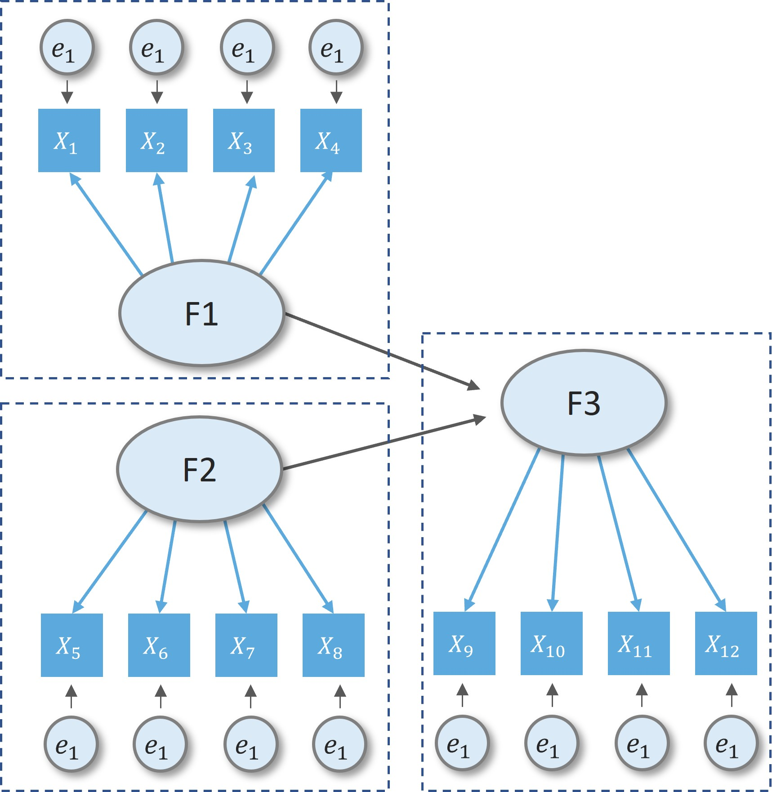
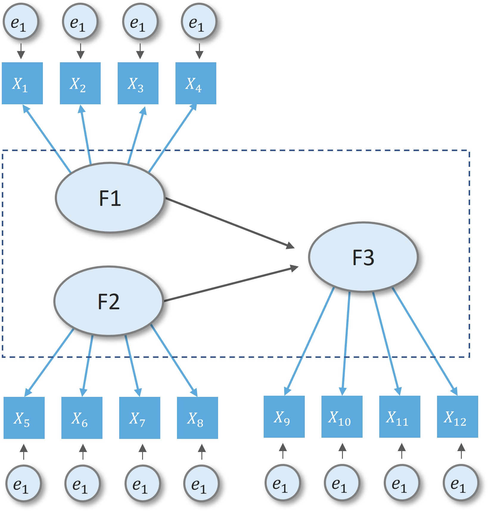
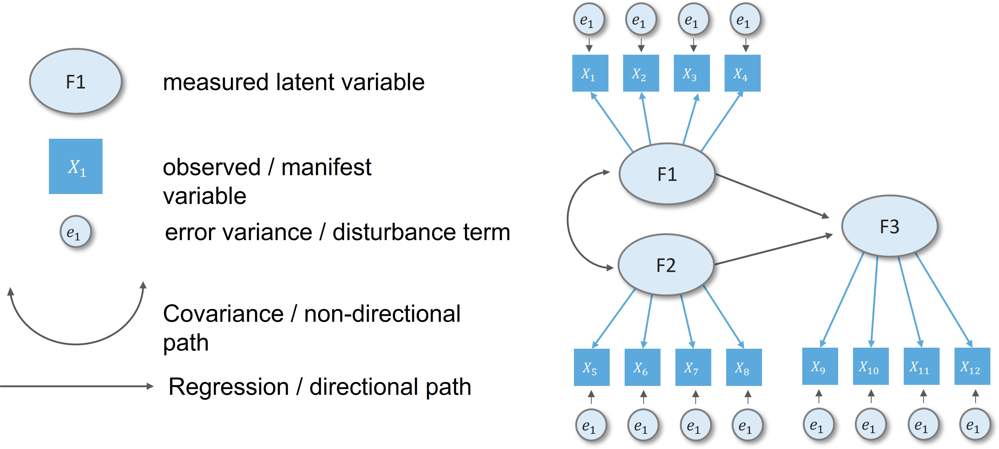
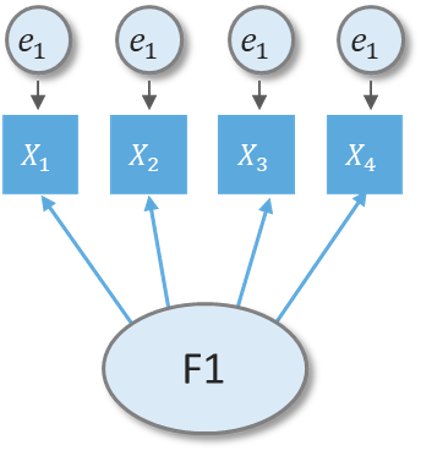
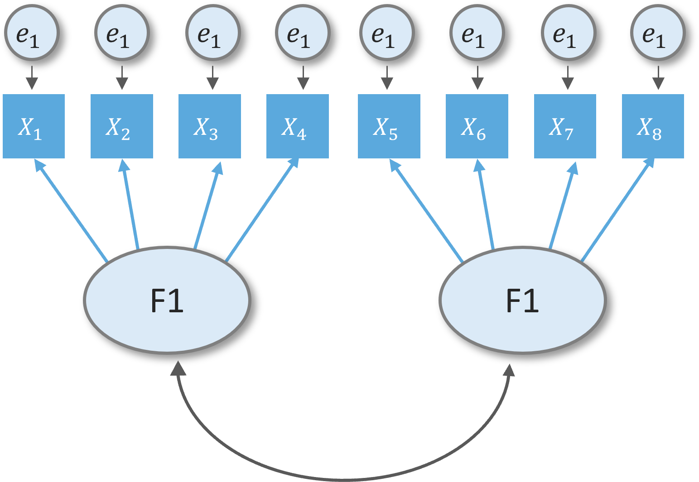
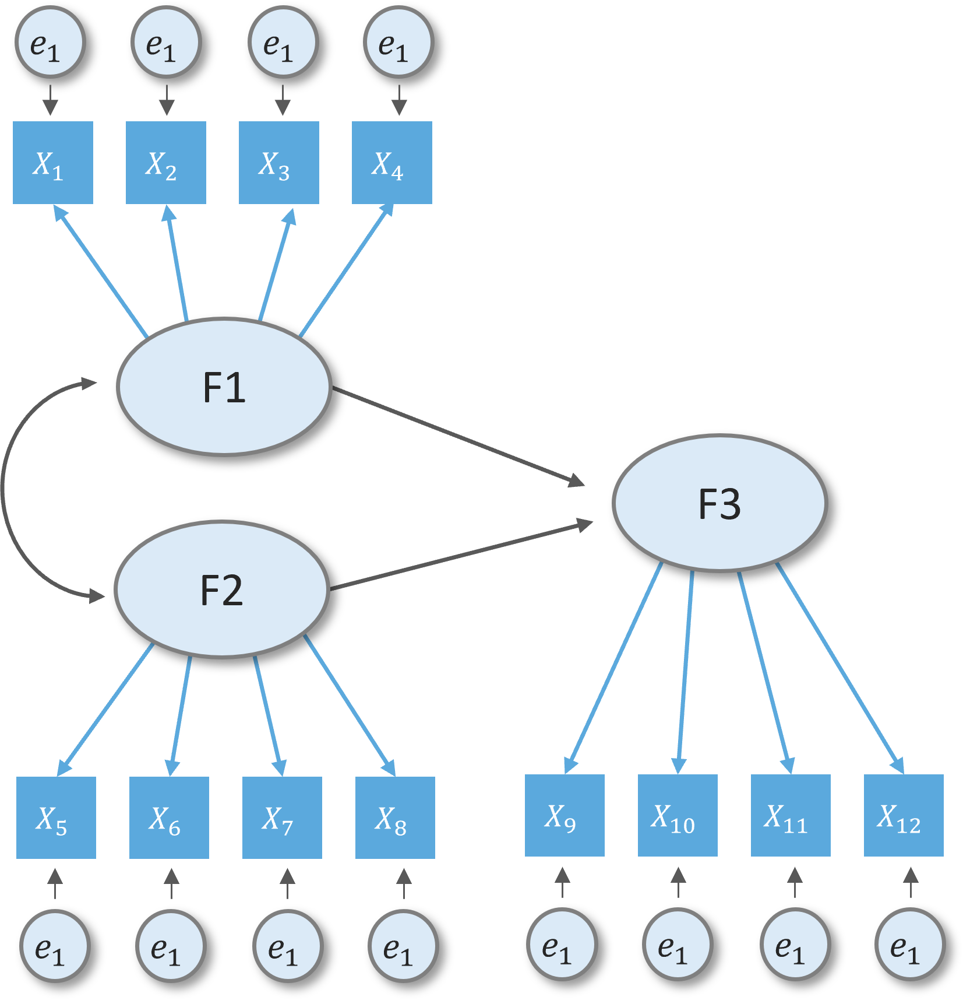
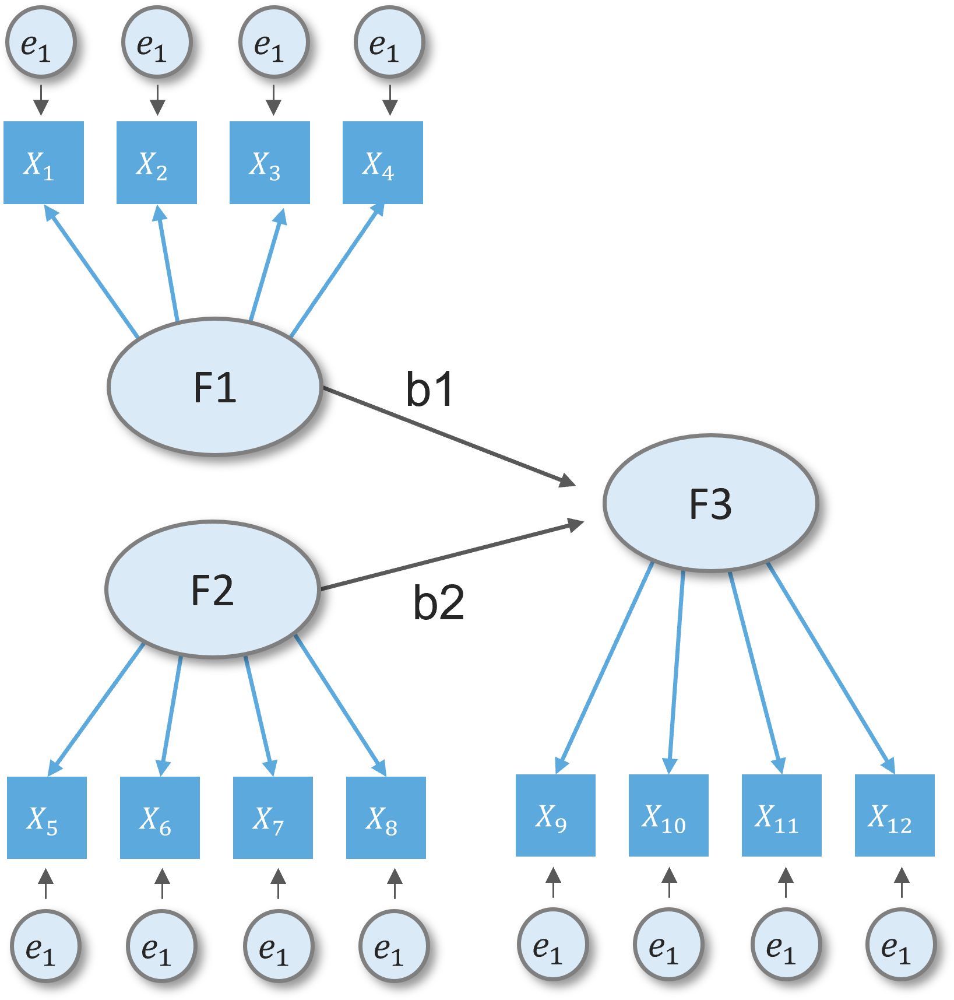
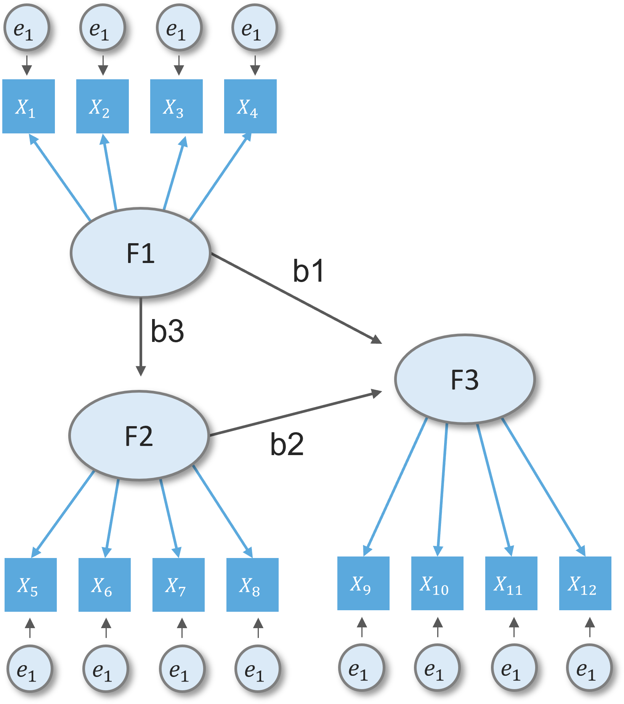

layout: true

```{r setup, echo=FALSE}
# working directory
setwd(dir = "D:/OneDrive - KMITL/Documents/Git files/trainings/SEM_presentation/02_cfa_sem/")

options(htmltools.dir.version = FALSE,
        knitr.table.format = "html")

knitr::opts_chunk$set(
  fig.width=9, fig.height=3.5, fig.retina=3,
  out.width = "100%",
  cache = FALSE,
  echo = TRUE,
  message = FALSE, 
  warning = FALSE,
  hiline = TRUE,
  comment = "",
  fig.retina = 3
)

```

```{r xaringan-themer, echo=FALSE, warning=FALSE}
library(xaringanthemer)

xaringanExtra::use_share_again()
xaringanExtra::style_share_again(share_buttons = c("twitter", "facebook", "linkedin"))
xaringanExtra::use_tile_view()
xaringanExtra::use_extra_styles(hover_code_line = TRUE,
                                mute_unhighlighted_code = FALSE)

xaringanExtra::use_animate_css()
xaringanExtra::use_animate_all("fade")

style_duo_accent(
  primary_color = "#073b4c",
  secondary_color = "#2a9d8f",
  inverse_background_color = "#073b4c",
  inverse_header_color = "#fff",
  # title_slide_background_color = "#073b4c",
  title_slide_background_image = "img/background.jpg",
  title_slide_text_color = "#212529",
  text_font_size = "1.1rem"
)


```

```{r data-library, echo=FALSE}
# libraries
pacman::p_load(knitr, tidyverse, psych, EFAtools, janitor)

# data management
data <- haven::read_sav("data/HBAT.sav") %>%
  select(x6:x18) %>% 
  select(-x15, -x17) %>% # removing variables with below acceptable MSA
  tibble() %>% 
  clean_names(.)

hbat_data <- haven::read_sav("data/HBAT_SEM_NOMISSING.sav") %>% 
  select(JS1:SI4) %>% mutate_all(as.numeric)

```

---

## Topic overview

**1**: CFA-SEM overview

**2**: CFA-SEM with Lavaan

**3**: Main steps in SEM

**4**: Assessing measurement model validity

**5**: Specifying the structural model

**6**: Assessing the structural model validity

---

class: middle center

# CFA-SEM overview
----

---

## What is SEM?

+ Not a one statistical "technique"

+ Integrates a number of different multivariate technique
  + Factor analysis
  + Regression
  + Simultaneous equation
  
+ Distinction between:
  + measurement model
  + structural model

---

## What is SEM?

.leftcol40[

#### Measurement model

+ measurement part of a a full SEM model
+ confirmatory factor analysis
]

.rightcol60[
```{r echo=FALSE, out.width="70%", fig.align='center'}

```
]

---

## What is SEM?

.leftcol40[

#### Measurement model

+ measurement part of a a full SEM model
+ confirmatory factor analysis

#### Structural model

+ relationship between constucts
+ full sem model is combination of measurement and structural component

]

.rightcol60[
```{r echo=FALSE, out.width="70%", fig.align='center'}

```
]

---

## Basic SEM conventions

<br>
.center[
```{r echo=FALSE, out.width="70%"}

```
]

---

class: middle center

# 2. CFA-SEM with Lavaan R package
----

---

## What is Lavaan?

.leftcol30[
+ *"developed to provide useRs, researchers, and teachers a free open-source, but commercial quality"*, Yves Rosseel (2012)
]

.rightcol70[
```{r eval=FALSE}
install.packages("lavaan")
library(lavaan)
example(cfa)
```
.code-output-scroll[
```{r echo=FALSE}
library(lavaan)
example(cfa)
```
]
]

---

## Major operators of lavaan syntax

<br>

.center[
```{r echo=FALSE, out.width="90%"}
knitr::include_graphics("img/lavaan_syntax.jpg")
```

]

---

## Major operators of lavaan syntax

.leftcol40[
#### Defining a reflective latent variable
```{r eval=FALSE}
model <- "F1 =~ x1 + x2 + x3 + x4"
```
<br>
```{r echo=FALSE, out.width="40%", fig.align='center'}

```
]

.rightcol[
#### Estimate factor covariance
```{r eval=FALSE}
model <- "F1 =~ x1 + x2 + x3 + x4
          F2 =~ x5 + X6 + x6 + x8
          F1 ~~ F2"
```
<br>
```{r echo=FALSE, out.width="60%", fig.align='center'}

```
]

---

## Major operators of lavaan syntax

.leftcol[
#### Estimate regression
```{r}
model <- "F1 =~ x1 + x2 + x3 + x4
          F2 =~ x5 + X6 + x7 + x8
          F3 =~ x9 + X10 + x11 + x12
          F1 ~~ F2
          F3 ~ F1 + F2"
```
]

.rightcol[
```{r echo=FALSE, fig.align='center', out.width="70%"}

```
]

---

## Major operators of lavaan syntax

.leftcol[
#### Insert a comment in the syntax
```{r}
model <- "F1 =~ x1 + x2 + x3 + x4
          F2 =~ x5 + X6 + x7 + x8
          F3 =~ x9 + X10 + x11 + x12
          
          # covariance
          F1 ~~ F2
          
          # F3 is regressed on F1 and F2
          F3 ~ F1 + F2"
```
]

.rightcol[
```{r echo=FALSE, fig.align='center', out.width="70%"}

```
]

---

## Major operators of lavaan syntax

.leftcol[
#### Label a parameter
```{r}
model <- "F1 =~ x1 + x2 + x3 + x4
          F2 =~ x5 + X6 + x7 + x8
          F3 =~ x9 + X10 + x11 + x12
          
          # covariance
          F1 ~~ F2
          
          # F3 is regressed on F1 and F2
          F3 ~ b1*F1 + b2*F2"
```
]

.rightcol[
```{r echo=FALSE, fig.align='center', out.width="70%"}

```
]

---

## Major operators of lavaan syntax

.leftcol[
#### Create a new parameter
```{r}
model <- "F1 =~ x1 + x2 + x3 + x4
          F2 =~ x5 + X6 + x7 + x8
          F3 =~ x9 + X10 + x11 + x12
          
          # regression
          F3 ~ b1*F1 + b2*F2
          F2 ~ b3*F1

          # F1 indirect effect
          ie := b3*b2

          # F1 total effect
          te := b3*b2 + b1"

```
]

.rightcol[
```{r echo=FALSE, fig.align='center', out.width="70%"}

```
]

---

class: middle center

# Main steps in SEM
----

---

## Main steps in SEM

1. Defining constructs

2. Developing the overall measurement model

3. Assessing measurement model validity

4. Specifying the structural model

5. Assessing structural model validity

---

## Dataset

.leftcol40[
+ HBAT company

+ HBAT is interested in understanding what affects employee's attitudes and behaviors that contributes to employee's retension.
]

.rightcol60[
```{r echo=FALSE}
rmarkdown::paged_table(hbat_data)
```
]

---

## Step 1: Defining individual constructs

+ Based on literature and preliminary interviews, a study was designed focusing on five key constructs.

  + *Job satisfaction (JS)* : reactions resulting from an appraisal of one's job situation.
  
  + *Organizational commitment (OC)*: extent to which an employees indentifies and feels part of HBAT.
  
  + *Staying intention (SI)*: extent to which an employee intends to continue working for HBAT.
  
  + *Environmental perceptions (EP)*: beliefs an employee has about day-to-day, physical working conditions.
  
  + *Attitudes towards cowrokers (AC)*: attitudes an employee has toward the coworkers he/she interacts with on a regular basis.

---

## Step 1: Defining individual constructs

.leftcol[
```{r echo=FALSE, fig.align='right'}
knitr::include_graphics("img/scale.png")
```
]

.rightcol[
```{r echo=FALSE, fig.align='right'}
knitr::include_graphics("img/scale2.png")
```
.font70[*Source: JF Hair et al. (2019) : Multivariate data analysis*]
]

---

## Step 2: Developing overall measurement model

.leftcol30[
+ Measurement theory model (CFA) for HBAT employees

+ Direction of the relationship between factors is not yet defined.


+ Focus on confirming the specified model with empirical model (using empirical data), hence confirmatory. 
]

.rightcol70[
```{r echo=FALSE, fig.align='right', out.width="75%"}
knitr::include_graphics("img/hbat_measurement.png")
```
<center>
.font70[*Source: JF Hair et al. (2019): Multivariate data analysis*]
</center>
]

---

class: center middle

# Let's practice!

---

## Step  3: Assessing measurement model validity

.leftcol40[

]

.rightcol60[
```{r echo=FALSE}
cfa_model <- "SI =~ SI1 + SI2 + SI3 + SI4
              JS =~ JS1 + JS2 + JS3 + JS4 + JS5
              AC =~ AC1 + AC2 + AC3 + AC4
              EP =~ EP1 + EP2 + EP3 + EP4
              OC =~ OC1 + OC2 + OC3 + OC4"
```

```{r eval=FALSE}
cfa_fit <- cfa(cfa_model, data = hbat_data)
cfa_fit %>% summary()
```

.code-output-scroll[
```{r echo=FALSE}
cfa_fit <- cfa(cfa_model, data = hbat_data)
cfa_fit %>% summary()
```
]
]


