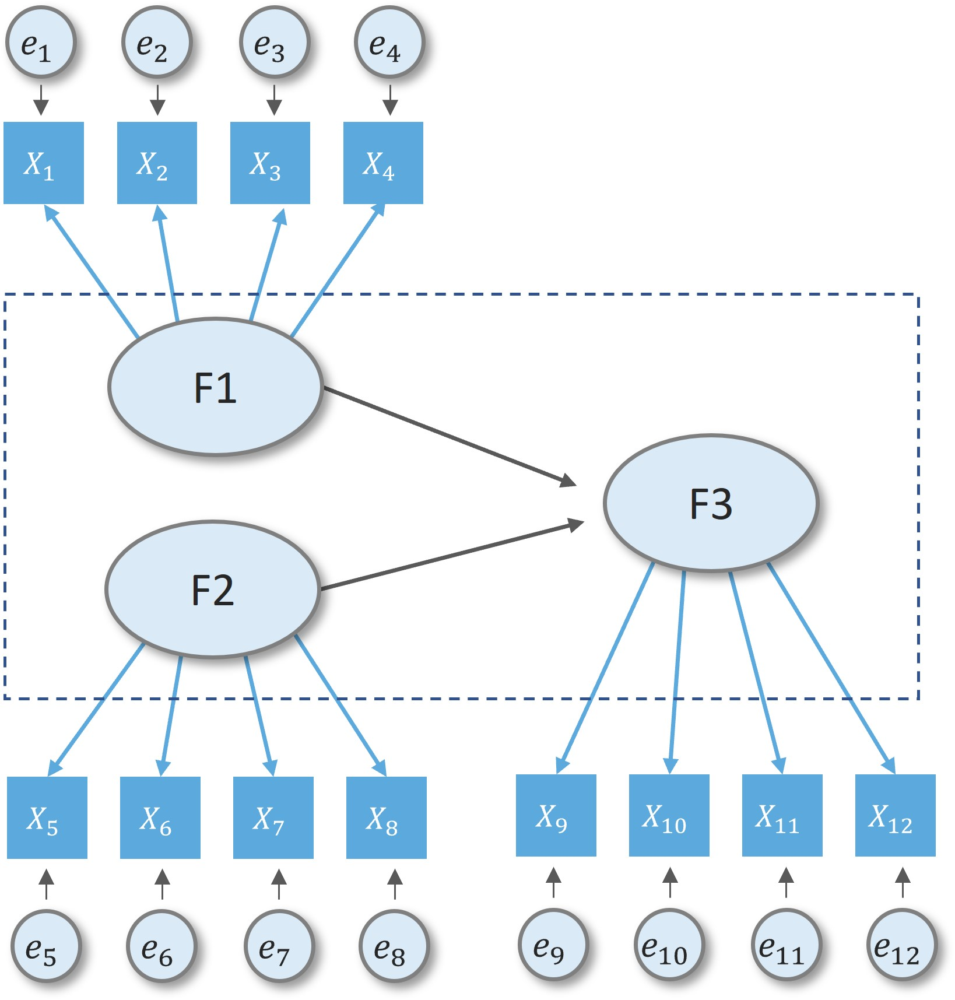
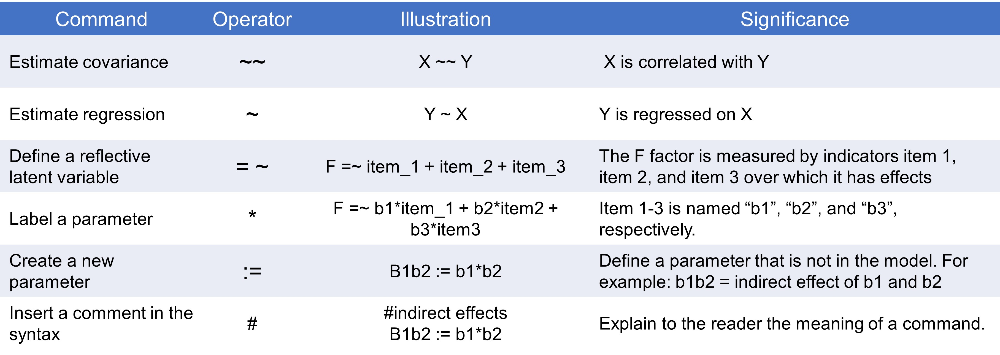
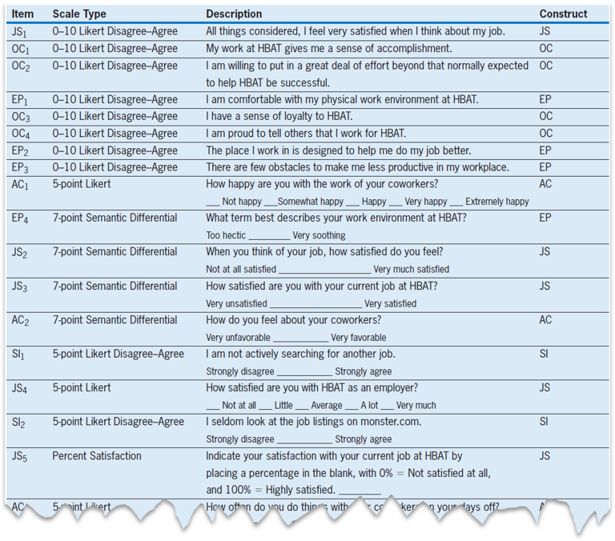
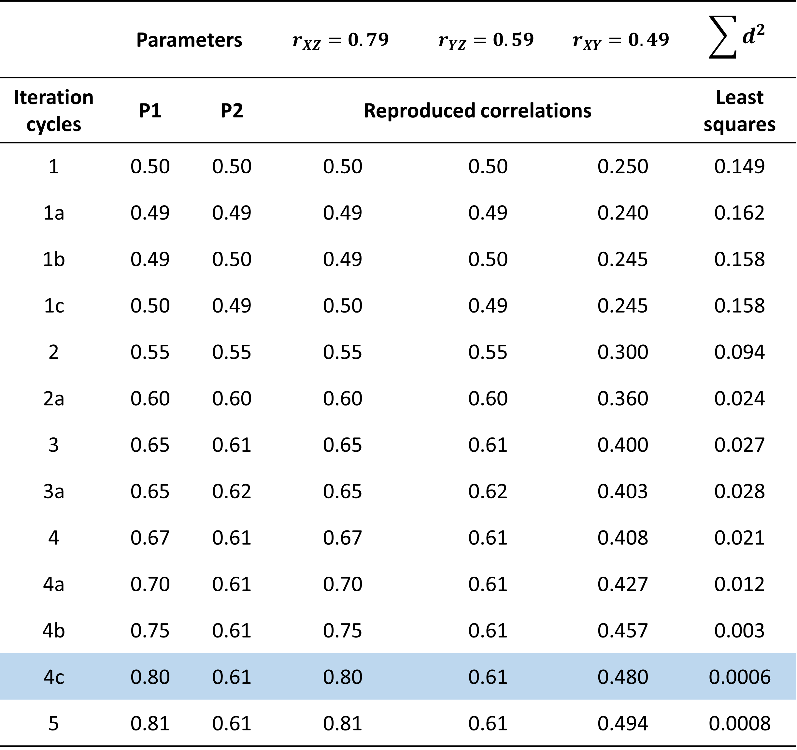
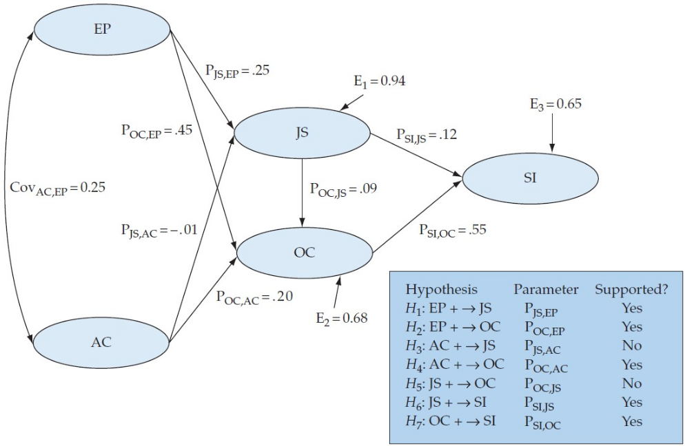

layout: true

```{r echo=FALSE}
# libraries
pacman::p_load(knitr, tidyverse, psych, EFAtools, janitor, metathis)

meta() %>% 
  meta_general(description = "SEM using R") %>% 
  meta_name("github-repo" = "chris-allones/SEM-R-training") %>% 
  meta_social(
    title = "SEM using R",
    description = "Training on structural equation modeling using R.",
    url = "https://chris-allones.github.io/SEM-R-training/index.html",
    og_type = "website",
    og_author = "Christopher Llones",
    twitter_card_type = "summary_large_image",
    twitter_creator = "@Topenomics",
    twitter_site = "@Topenomics"
  )

```

```{r setup, echo=FALSE}
# working directory
setwd(dir = "D:/OneDrive - KMITL/Documents/Git files/trainings/SEM_presentation/02_cfa_sem/")

options(htmltools.dir.version = FALSE,
        knitr.table.format = "html")

knitr::opts_chunk$set(
  fig.width=9, fig.height=3.5, fig.retina=3,
  out.width = "100%",
  cache = FALSE,
  echo = TRUE,
  message = FALSE, 
  warning = FALSE,
  hiline = TRUE,
  comment = "",
  fig.retina = 3
)

```

```{r xaringan-themer, echo=FALSE, warning=FALSE}
library(xaringanthemer)

xaringanExtra::use_share_again()
xaringanExtra::style_share_again(share_buttons = c("twitter", "facebook", "linkedin"))
xaringanExtra::use_tile_view()
xaringanExtra::use_extra_styles(hover_code_line = TRUE,
                                mute_unhighlighted_code = FALSE)

xaringanExtra::use_animate_css()
xaringanExtra::use_animate_all("fade")

style_duo_accent(
  primary_color = "#073b4c",
  secondary_color = "#2a9d8f",
  inverse_background_color = "#073b4c",
  inverse_header_color = "#fff",
  # title_slide_background_color = "#073b4c",
  title_slide_background_image = "img/background.jpg",
  title_slide_text_color = "#212529",
  text_font_size = "1.1rem"
)


```

```{r data-library, echo=FALSE}
# libraries
pacman::p_load(knitr, tidyverse, psych, EFAtools, janitor)

# data management
data <- haven::read_sav("data/HBAT.sav") %>%
  select(x6:x18) %>% 
  select(-x15, -x17) %>% # removing variables with below acceptable MSA
  tibble() %>% 
  clean_names(.)

hbat_data <- haven::read_sav("data/HBAT_SEM_NOMISSING.sav") %>% 
  select(JS1:SI4) %>% mutate_all(as.numeric)

```

---

## Topic overview

**1**: CFA-SEM overview

**2**: CFA-SEM with Lavaan

**3**: Defining  constructs

**4**: Developing the overall measurement model

**5**: Assessing measurement model validity

**6**: Specifying the structural model

**7**: Assessing structural model validity

---

class: middle center

# CFA-SEM overview
----

---

## What is SEM?

+ Not a one statistical "technique"

+ Integrates a number of different multivariate technique
  + Factor analysis
  + Regression
  + Simultaneous equation
  
+ Distinction between:
  + measurement model
  + structural model

---

## What is SEM?

.leftcol40[

#### Measurement model

+ measurement part of a a full SEM model
+ confirmatory factor analysis
]

.rightcol60[
```{r echo=FALSE, out.width="70%", fig.align='center'}
knitr::include_graphics("img/measurement_part_2.jpg")
```
]

---

## What is SEM?

.leftcol40[

#### Measurement model

+ measurement part of a a full SEM model
+ confirmatory factor analysis

#### Structural model

+ relationship between constucts
+ full sem model is combination of measurement and structural component

]

.rightcol60[
```{r echo=FALSE, out.width="70%", fig.align='center'}

```
]

---

## Basic SEM conventions

<br>

.center[
```{r echo=FALSE, out.width="70%"}
knitr::include_graphics("img/sem_convention_2.jpg")
```
]

---

class: middle center

# 2. CFA-SEM with Lavaan R package
----

---

## What is Lavaan?

.leftcol30[
+ *"developed to provide useRs, researchers, and teachers a free open-source, but commercial quality"*, Yves Rosseel (2012)

+ Check-out their [lavaan tutorial](https://lavaan.ugent.be/tutorial/index.html)
]

.rightcol70[
```{r eval=FALSE}
install.packages("lavaan")
library(lavaan)
example(cfa)
```
.code-output-scroll[
```{r echo=FALSE}
library(lavaan)
example(cfa)
```
]
]

---

## Major operators of lavaan syntax

<br>

.center[
```{r echo=FALSE, out.width="90%"}

```

]

---

## Major operators of lavaan syntax

.leftcol40[
#### Defining a reflective latent variable
```{r eval=FALSE}
model <- "F1 =~ x1 + x2 + x3 + x4"
```
<br>
```{r echo=FALSE, out.width="40%", fig.align='center'}
knitr::include_graphics("img/sample_syntax1.png")
```
]

.rightcol[
#### Estimate factor covariance
```{r eval=FALSE}
model <- "F1 =~ x1 + x2 + x3 + x4
          F2 =~ x5 + X6 + x6 + x8
          F1 ~~ F2"
```
<br>
```{r echo=FALSE, out.width="60%", fig.align='center'}

```
]

---

## Major operators of lavaan syntax

.leftcol[
#### Estimate regression
```{r}
model <- "F1 =~ x1 + x2 + x3 + x4
          F2 =~ x5 + X6 + x7 + x8
          F3 =~ x9 + X10 + x11 + x12
          F1 ~~ F2
          F3 ~ F1 + F2"
```
]

.rightcol[
```{r echo=FALSE, fig.align='center', out.width="70%"}

```
]

---

## Major operators of lavaan syntax

.leftcol[
#### Insert a comment in the syntax
```{r}
model <- "F1 =~ x1 + x2 + x3 + x4
          F2 =~ x5 + X6 + x7 + x8
          F3 =~ x9 + X10 + x11 + x12
          
          # covariance
          F1 ~~ F2
          
          # F3 is regressed on F1 and F2
          F3 ~ F1 + F2"
```
]

.rightcol[
```{r echo=FALSE, fig.align='center', out.width="70%"}

```
]

---

## Major operators of lavaan syntax

.leftcol[
#### Label a parameter
```{r}
model <- "F1 =~ x1 + x2 + x3 + x4
          F2 =~ x5 + X6 + x7 + x8
          F3 =~ x9 + X10 + x11 + x12
          
          # covariance
          F1 ~~ F2
          
          # F3 is regressed on F1 and F2
          F3 ~ b1*F1 + b2*F2"
```
]

.rightcol[
```{r echo=FALSE, fig.align='center', out.width="70%"}
knitr::include_graphics("img/sample_syntax4.png")
```
]

---

## Major operators of lavaan syntax

.leftcol[
#### Create a new parameter
```{r}
model <- "F1 =~ x1 + x2 + x3 + x4
          F2 =~ x5 + X6 + x7 + x8
          F3 =~ x9 + X10 + x11 + x12
          
          # regression
          F3 ~ b1*F1 + b2*F2
          F2 ~ b3*F1

          # F1 indirect effect
          ie := b3*b2

          # F1 total effect
          te := b3*b2 + b1"

```
]

.rightcol[
```{r echo=FALSE, fig.align='center', out.width="70%"}

```
]

---

class: middle center

# Main steps in SEM
----

---

## Main steps in SEM

1. Defining constructs

2. Developing the overall measurement model

3. Assessing measurement model validity

4. Specifying the structural model

5. Assessing structural model validity

---

class: center middle

# 1. Defining Constructs
----

---

## Dataset

.leftcol40[
+ HBAT company

+ HBAT is interested in understanding what affects employee's attitudes and behaviors that contributes to employee's retension.
]

.rightcol60[
```{r echo=FALSE}
rmarkdown::paged_table(hbat_data)
```
]

---

## Defining individual constructs

+ Based on literature and preliminary interviews, a study was designed focusing on five key constructs.

  + *Job satisfaction (JS)* : reactions resulting from an appraisal of one's job situation.
  
  + *Organizational commitment (OC)*: extent to which an employees indentifies and feels part of HBAT.
  
  + *Staying intention (SI)*: extent to which an employee intends to continue working for HBAT.
  
  + *Environmental perceptions (EP)*: beliefs an employee has about day-to-day, physical working conditions.
  
  + *Attitudes towards cowrokers (AC)*: attitudes an employee has toward the coworkers he/she interacts with on a regular basis.

---

## Defining individual constructs

.leftcol[
```{r echo=FALSE, fig.align='right'}

```
]

.rightcol[
```{r echo=FALSE, fig.align='right'}
knitr::include_graphics("img/scale2.png")
```
.font70[*Source: JF Hair et al. (2019) : Multivariate data analysis*]
]


---
class: center middle

# Step 2. Developing overall measurement model
----

---

## Developing overall measurement model

.leftcol30[
+ Measurement theory model (CFA) for HBAT employees

+ Direction of the relationship between factors is not yet defined.


+ Focus on confirming the specified model with empirical model (using empirical data), hence confirmatory. 
]

.rightcol70[
```{r echo=FALSE, fig.align='right', out.width="75%"}
knitr::include_graphics("img/hbat_measurement.png")
```
<center>
.font70[*Source: JF Hair et al. (2019): Multivariate data analysis*]
</center>
]

---

class: center middle

# Let's practice!


---
class: center middle

# Step 3. Assessing measurement model validity
----

---

## Basic principles

.leftcol40[
+ Compare covariance matrix of the research data $\text{S}$ and reproduced covariance $\Sigma$

+ Hypothesis:
  + Null: $\text{S} = \Sigma$
  + Atternative: $\text{S} \ne \Sigma$

+ Idea is to arrived with a parameter that minimizes the difference of $\text{S}$ and  $\Sigma$

]

.rightcol60[
```{r echo=FALSE}
cfa_model <- "SI =~ SI1 + SI2 + SI3 + SI4
              JS =~ JS1 + JS2 + JS3 + JS4 + JS5
              AC =~ AC1 + AC2 + AC3 + AC4
              EP =~ EP1 + EP2 + EP3 + EP4
              OC =~ OC1 + OC2 + OC3 + OC4"
```

```{r eval=FALSE}
cfa_fit <- cfa(cfa_model, data = hbat_data)
cfa_fit %>% summary()
```

.code-output-scroll[
```{r echo=FALSE}
cfa_fit <- cfa(cfa_model, data = hbat_data)
cfa_fit %>% summary()
```
]
]

---

## Basic principles

.leftcol40[
+ Compare covariance matrix of the research data $\text{S}$ and reproduced covariance $\Sigma$

+ Hypothesis:
  + Null: $\text{S} = \Sigma$
  + Atternative: $\text{S} \ne \Sigma$

+ Idea is to arrived with a parameter that minimizes the difference of $\text{S}$ and  $\Sigma$

]

.rightcol60[
```{r echo=FALSE, out.width="60%", fig.align='center'}

```
]

---

## Basic principles

.leftcol40[

+ To understand the SEM process, consider the Table on the right.

+ Iterative procedure using least square method.

```{r echo=FALSE, fig.align='center', out.width="80%"}

```

]

.rightcol60[
```{r echo=FALSE, out.width="80%", fig.align='right'}

```
]

---

## Summary output

.leftcol20[

+ Overall results

+ Loadings

+ Variances

]

.rightcol80[
```{r eval=FALSE}
cfa_fit <- cfa(cfa_model, data = hbat_data)
summary(cfa_fit)
```
.code-output-scroll[
```{r echo=FALSE}
cfa_fit <- cfa(cfa_model, data = hbat_data)
summary(cfa_fit)
```
]
]

---

## Summary output

.leftcol40[
#### Overall results

$df = \frac{1}{2} p (p + 1) - k$

$p$ = total observed variables

$k$ = total estimated parameters

Resulting $df$ for a three-item factor would be zero.
]

.rightcol60[
```{r eval=FALSE}
cfa_fit <- cfa(cfa_model, data = hbat_data)
summary(cfa_fit)
```
.code-output-scroll[
```{r echo=FALSE}
cfa_fit <- cfa(cfa_model, data = hbat_data)
summary(cfa_fit)
```
]
]

---

## Summary output

.leftcol20[
#### Loadings

-strength of the relationship of the items to the factor.
]

.rightcol80[
```{r eval=FALSE}
cfa_fit <- cfa(cfa_model, data = hbat_data)
summary(cfa_fit, standardized = TRUE)
```
.code-output-scroll[
```{r echo=FALSE}
cfa_fit <- cfa(cfa_model, data = hbat_data)
summary(cfa_fit, standardized = TRUE)
```
]
]

---

## Summary output

.leftcol20[
#### Variances

Refer to unique variance that the factor unable to account for. Similar to error term in OLS, hence it is also term as error variance.
]

.rightcol80[
```{r eval=FALSE}
cfa_fit <- cfa(cfa_model, data = hbat_data)
summary(cfa_fit, standardized = TRUE)
```
.code-output-scroll[
```{r echo=FALSE}
cfa_fit <- cfa(cfa_model, data = hbat_data)
summary(cfa_fit, standardized = TRUE)
```
]
]

---

## Fit indices

.leftcol40[
#### Goodness of fit indices

+ Goodness-of-fit index (GFI)
+ Adjusted goodness-fit-index (AGFI)
+ Comparative fit index (CFI)
+ Normed fit index (NFI)
+ Non-normed fit index (NNF)

#### Badness of fit indices

+ Standard root mean squrare residual (SRMR)
+ Root mean square error of approximation (RMSEA)
]


.rightcol60[
```{r echo=FALSE, out.width="80%", fig.align='center'}
knitr::include_graphics("img/sample_gof.png")
```

.font70[*Sample GOF results from W. Shiau & M. Luo (2013). Continuance intention of blog users: The impact of perceived enjoyment, habit, user involvement and blogging time.*]
]

---

## Fit indices

.leftcol40[
#### Goodness of fit indices

+ Goodness-of-fit index (GFI)
+ Adjusted goodness-fit-index (AGFI)
+ Comparative fit index (CFI)
+ Normed fit index (NFI)
+ Non-normed fit index (NNF)
]

.rightcol60[
```{r}
fitMeasures(cfa_fit)
```
]

---

## Fit indices

.leftcol40[
#### Goodness of fit indices

+ Goodness-of-fit index (GFI)
+ Adjusted goodness-fit-index (AGFI)
+ Comparative fit index (CFI)
+ Normed fit index (NFI)
+ Non-normed fit index (NNF)
]

.rightcol60[
```{r}
fitMeasures(cfa_fit,  fit.measures = c("gfi", "agfi", "cfi", "nfi", "nnfi"))
```
]

---

## Fit indices

.leftcol40[
#### Badness of fit indices

+ Standard root mean squrare residual (SRMR)
+ Root mean square error of approximation (RMSEA)
]

.rightcol60[
```{r}
fitMeasures(cfa_fit,  fit.measures = c("srmr", "rmsea"))
```
]

---
class: middle center

# Let's practice

---

## Reliability and validity test

.leftcol30[
#### Reliability test
+ Composite reliability

#### Validity test
+ Convergent validity
+ Discriminant validity
]

.rightcol70[
```{r echo=FALSE, out.width="95%"}
knitr::include_graphics("img/reliability_validity.png")
```

.font70[*Source: A. Hou, W. Shiau, & R. Shang (2019). The involvement paradox. The role of cognitive absorption in mobile instant messaging user satisfaction.*]
]

---

## Reliability and validity test

.leftcol[
+ Composite reliability: `alpha` > `0.70`

+ Convergent validity: AVE (`avevar`) > `0.50`

+ Discriminant validity: `omega` > `0.7`
]


.rightcol[
```{r eval=FALSE}
library(semTools)
reliability(cfa_fit) %>% round(3)
```

```{r echo=FALSE}
semTools::reliability(cfa_fit) %>% round(3)
```

]

---

class: center middle

# Step 4: Specifying the structural model
----

---
## CFA model to structural model
```{r echo=FALSE, out.width="60%", fig.align='center'}
knitr::include_graphics("img/cfa_sem.png")
```

---

## Defining structural model

#### Hypothesis:

+ H1: Environmental perceptions are positively related to job satisfaction.
+ H2: Environemtnal perceptions are positively related to organizational commitment.
+ H3: Attitudes toward coworkers are positively related to job satisfaction.
+ H4: Attitudes toward coworkers are positively related to organizational commitment.
+ H5: Job satisfaction is related positively to organizational commitment.
+ H6: Job satisfaction is related  positively to staying intentions.
+ H7: Organizational commitment is related positively to staying intention.

---

## Defining structural model

```{r echo=FALSE, fig.align='center', out.width="60%"}
knitr::include_graphics("img/structural_model.png")
```


---

class: center middle

# Let's practice

---

## Defining structural model

.leftcol30[

```{r echo=FALSE}
sem_model <- "SI =~ SI1 + SI2 + SI3 + SI4
              JS =~ JS1 + JS2 + JS3 + JS4 + JS5
              AC =~ AC1 + AC2 + AC3 + AC4
              EP =~ EP1 + EP2 + EP3 + EP4
              OC =~ OC1 + OC2 + OC3 + OC4
              EP ~~ AC
              JS ~ H1*EP + H3*AC
              OC ~ H2*EP + H4*AC + H5*JS
              SI ~ H6*JS + H7*OC"

sem_fit <- sem(model = sem_model, data = hbat_data)
```

```{r eval=FALSE}
library(semPlot)
semPaths(object = sem_fit,
         what = "std",
         layout = "tree2",
         intercepts = FALSE,
         residuals = FALSE)
```
]

.rightcol70[
```{r echo=FALSE, out.width="180%", fig.align='center'}
knitr::include_graphics("img/sempath2.svg")
```
]

---

## Defining structural model

```{r echo=FALSE, out.width="70%", fig.align='center'}

```

---

## GOF measures between structural and CFA model

.leftcol40[
```{r eval=FALSE}
gof_indices <- c('chisq', 'df','pvalue', "gfi", 
                 'rmsea', 'rmr', 'srmr', 'nfi', 
                 'nnfi', 'cfi', 'agfi')
fitmeasures(sem_fit, fit.measures = gof_indices)
fitmeasures(cfa_fit, fit.measures = gof_indices)
```

```{r echo=FALSE}
gof_indices <- c('chisq', 'df','pvalue', "gfi", 
                 'rmsea', 'rmr', 'srmr', 'nfi', 
                 'nnfi', 'cfi', 'agfi')
fitmeasures(sem_fit, fit.measures = gof_indices)
fitmeasures(cfa_fit, fit.measures = gof_indices)
```
]

.rightcol60[
```{r echo=FALSE, out.width="90%", fig.align='right'}
knitr::include_graphics("img/fit_indices.png")
```
]

---

## What's next?

.leftcol40[
+ Modification indeces

+ Handling heywood cases

+ Comparing competing models

+ Formative scales in SEM

+ Higher-order factor analysis

+ Multigroup analysis
]

.rightcol60[
```{r echo=FALSE, out.width="70%", fig.align='center'}
knitr::include_graphics("img/we_can.gif")
```
]

---

class: middle center

# Thank you!

#### Slides created via the R packages:

.leftcol[
 

### xaringan by Yihui
]

.rightcol[
 

### xaringanthemer and xaringanExtra by Garrick
]


