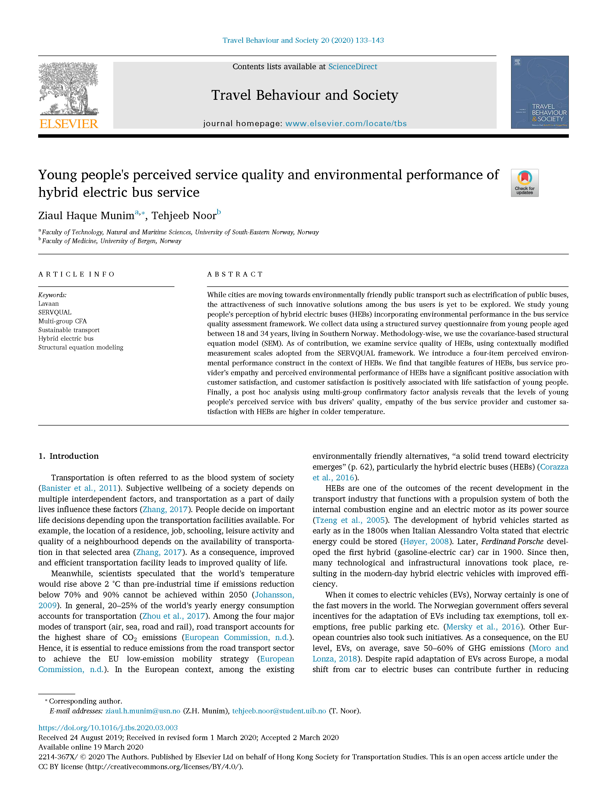
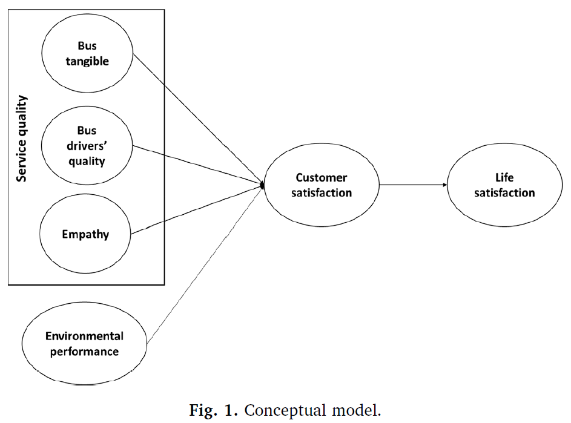
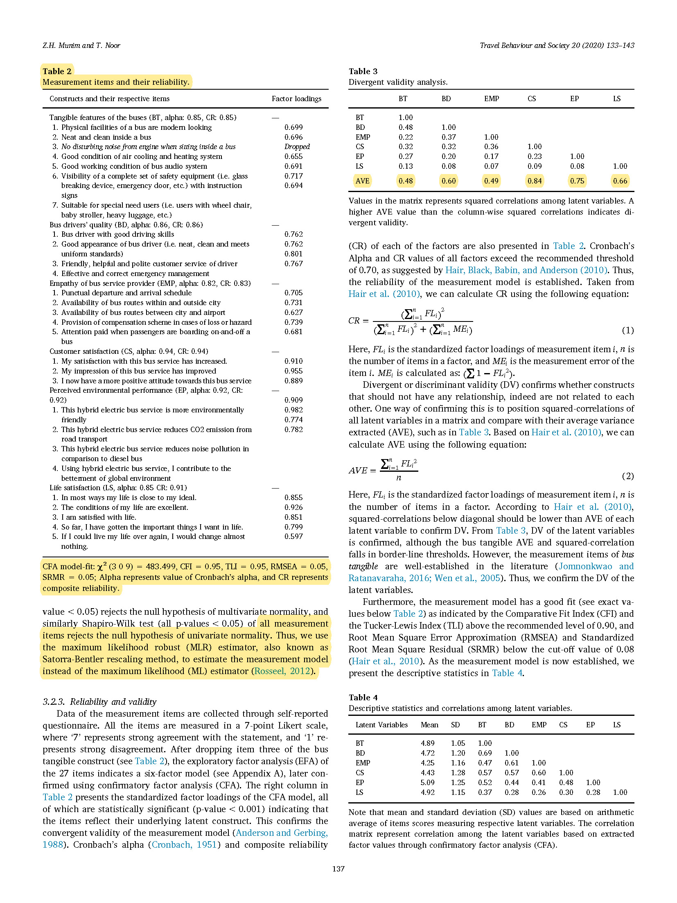
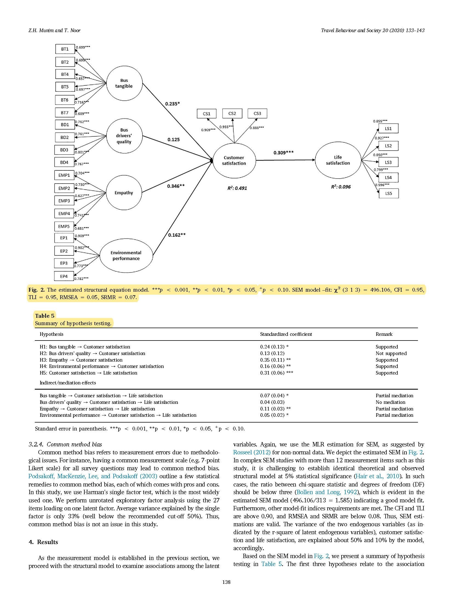

layout: true

```{r meta, echo=FALSE}
# libraries
pacman::p_load(knitr, tidyverse, psych, EFAtools, janitor, metathis)

xaringanExtra::use_share_again()
xaringanExtra::style_share_again(share_buttons = c("twitter", "facebook", "linkedin"))

meta() %>% 
  meta_name("github-repo" = "chris-allones/SEM-R-training") %>% 
  meta_social(
    title = "SEM using R",
    description = "Training on structural equation modeling using R.",
    url = "https://chris-allones.github.io/SEM-R-training/index.html",
    image = "https://chris-allones.github.io/SEM-R-training/images/preview.png",
    og_type = "website",
    og_author = "Christopher Llones",
    twitter_card_type = "summary_large_image",
    twitter_creator = "@Topenomics",
    twitter_site = "@Topenomics"
  )

```

```{r setup, echo=FALSE}
# working directory
# setwd(dir = "D:/OneDrive - KMITL/Documents/Git files/trainings/SEM_presentation/03_case_study")

options(htmltools.dir.version = FALSE,
        knitr.table.format = "html")

knitr::opts_chunk$set(
  fig.width=9, fig.height=3.5, fig.retina=3,
  out.width = "100%",
  cache = FALSE,
  echo = TRUE,
  message = FALSE, 
  warning = FALSE,
  hiline = TRUE,
  comment = "",
  fig.retina = 3
)

```

```{r xaringan-themer, echo=FALSE, warning=FALSE}
library(xaringanthemer)

xaringanExtra::use_share_again()
xaringanExtra::style_share_again(share_buttons = c("twitter", "facebook", "linkedin"))
xaringanExtra::use_tile_view()
xaringanExtra::use_extra_styles(hover_code_line = TRUE,
                                mute_unhighlighted_code = FALSE)

xaringanExtra::use_animate_css()
xaringanExtra::use_animate_all("fade")

style_duo_accent(
  primary_color = "#073b4c",
  secondary_color = "#2a9d8f",
  inverse_background_color = "#073b4c",
  inverse_header_color = "#fff",
  # title_slide_background_color = "#073b4c",
  title_slide_background_image = "img/background.jpg",
  title_slide_text_color = "#212529",
  text_font_size = "1.1rem"
)


```

```{r data-library, echo=FALSE}
# libraries
pacman::p_load(knitr, tidyverse, janitor, readxl)

# data management
data <- read_excel("data/e_bus_customer_satisfaction.xlsx") %>% 
  clean_names() %>% 
  select(bt1:bt7, bd1:bd4, emp1:emp5, cs1:cs3, ep1:ep4, ls1:ls5)

```

---

## Journal article

.leftcol30[
+ Access the article by clicking the [DOI link](https://doi.org/10.1016/j.tbs.2020.03.003).

+ Fortunately, the author provided the data publicly.

+ In this session we will replicate some of the analysis in the paper.
]

.rightcol70[
.code-output-scroll[
```{r echo=FALSE}

```
]
]

---

## Conceptual model

```{r echo=FALSE, out.width="60%", fig.align='center'}

```


---

## Measurement, validity and  reliability results

.code-output-scroll[
```{r echo=FALSE}

```
]


---

## Structural model and indirect effects

.code-output-scroll[
```{r echo=FALSE}

```
]

---
class: middle center

# Thank you!

#### Slides created via the R packages:

.leftcol[
 

### xaringan by Yihui
]

.rightcol[
 

### xaringanthemer and xaringanExtra by Garrick
]


